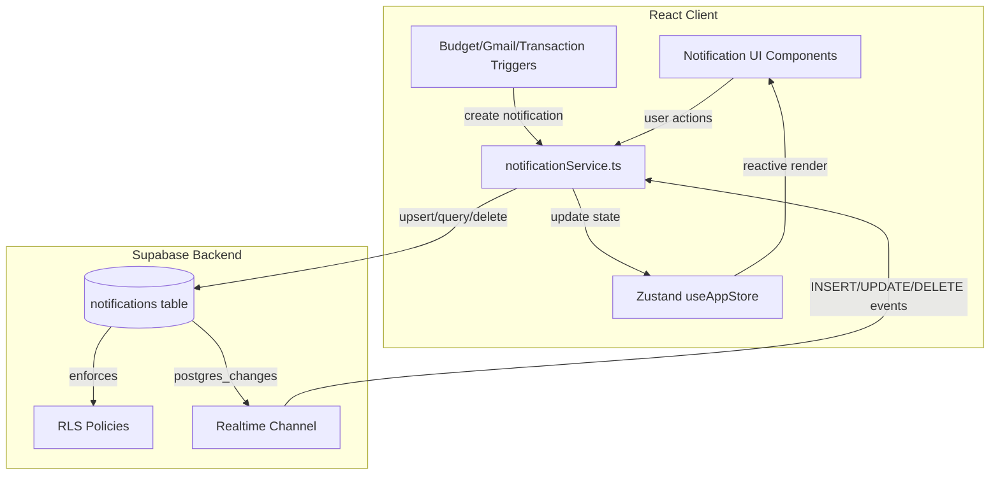
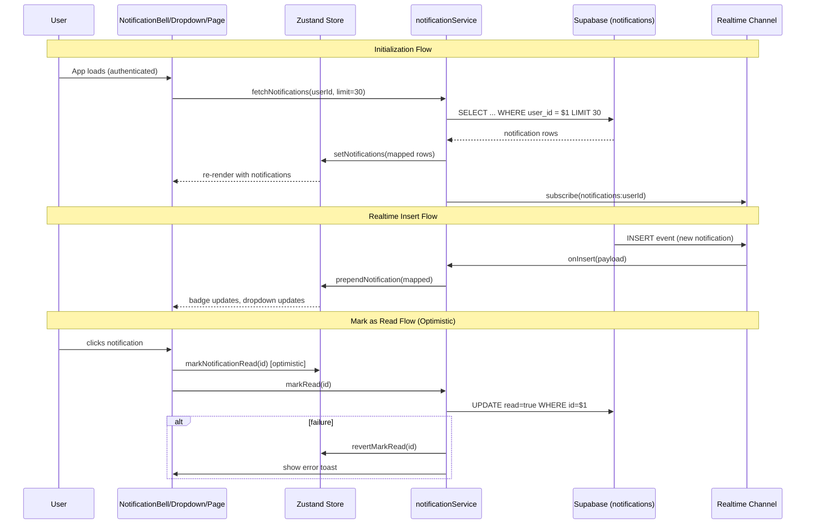

# Design Document: Notification System

## Implementation Note - 2026-06-20

The implemented code follows this design with one pragmatic adjustment: mobile delete is implemented as an explicit touch-friendly delete action in the dedicated notifications page instead of a gesture-only swipe threshold. This avoids accidental deletes and keeps the interaction accessible while still providing mobile deletion support.

## Overview

The Notification System transforms the existing in-memory notification placeholder into a fully persistent, real-time, Supabase-backed notification infrastructure. It provides users with immediate feedback about budget alerts, Gmail sync results, transaction events, and system messages through a bell icon dropdown, a dedicated notifications page, and realtime push updates.

**Key Design Decisions:**

1. **Single Supabase channel per session** — Follows existing realtime pattern (budgetService) with one channel filtered by `user_id` to minimize connections.
2. **Optimistic UI with rollback** — Mark-as-read and delete operations update Zustand immediately, reverting on failure.
3. **Service-layer architecture** — New `notificationService.ts` follows the established pattern of exported functions using `getSupabaseClient()`.
4. **Upsert-based deduplication** — Uses PostgreSQL `ON CONFLICT` on `(user_id, dedupe_key)` for atomic dedup at the DB level.
5. **Extend existing store** — The `useAppStore` already has notification actions; we enhance them to sync with Supabase rather than replacing them.
6. **Priority field addition** — `AppNotification` type gets an optional `priority` field (`'low' | 'normal' | 'high'`).

## Architecture

### System Architecture Diagram



### Data Flow



## Components and Interfaces

### Service Layer: `src/services/notificationService.ts`

```typescript
// Core CRUD operations
export async function fetchNotifications(
  userId: string, 
  options?: { limit?: number; offset?: number; type?: NotificationType; unreadOnly?: boolean }
): Promise<AppNotification[]>;

export async function createNotification(
  userId: string, 
  data: CreateNotificationInput
): Promise<AppNotification | null>;

export async function markNotificationRead(
  userId: string, 
  notificationId: string
): Promise<boolean>;

export async function markAllNotificationsRead(userId: string): Promise<boolean>;

export async function deleteNotification(
  userId: string, 
  notificationId: string
): Promise<boolean>;

// Realtime subscription
export function subscribeToNotifications(
  userId: string,
  callbacks: {
    onInsert: (notification: AppNotification) => void;
    onUpdate: (notification: AppNotification) => void;
    onDelete: (id: string) => void;
    onError?: (error: Error) => void;
  }
): () => void;

// Cleanup
export async function enforceNotificationLimit(userId: string): Promise<void>;

// Count
export async function getUnreadCount(userId: string): Promise<number>;
```

### Notification Trigger Functions: `src/services/notificationTriggers.ts`

```typescript
// Budget triggers (called from DashboardPage after budget data loads)
export async function triggerBudgetWarningNotification(
  userId: string,
  budget: Budget
): Promise<void>;

export async function triggerBudgetOverNotification(
  userId: string,
  budget: Budget
): Promise<void>;

// Gmail triggers (called from gmailService after sync completes)
export async function triggerGmailSyncNotification(
  userId: string,
  pendingCount: number,
  failedCount: number
): Promise<void>;

// Transaction triggers (called from transactionService after gmail transaction persists)
export async function triggerTransactionReviewNotification(
  userId: string,
  transaction: Transaction
): Promise<void>;
```

### UI Components

| Component | Location | Responsibility |
|-----------|----------|----------------|
| `NotificationBell` | `src/components/notifications/NotificationBell.tsx` | Bell icon, badge, toggle dropdown (enhance existing) |
| `NotificationDropdown` | `src/components/notifications/NotificationDropdown.tsx` | Floating panel with 15 recent items, virtual scroll (enhance existing) |
| `NotificationItem` | `src/components/notifications/NotificationItem.tsx` | Single notification display with priority styling (enhance existing) |
| `NotificationPage` | `src/features/notifications/NotificationsPage.tsx` | Full page, filters, pagination (new) |
| `NotificationFilters` | `src/features/notifications/NotificationFilters.tsx` | Type filter chips + unread toggle (new) |
| `SwipeableNotification` | `src/features/notifications/SwipeableNotification.tsx` | Mobile swipe-to-delete wrapper (new) |

### Store Enhancements: `useAppStore`

The existing store actions remain but their implementations change to call `notificationService` for persistence:

```typescript
// Enhanced actions (sync with Supabase)
addNotification: (notification) => void;        // Now calls createNotification()
markNotificationRead: (id) => void;             // Now calls markNotificationRead() with optimistic update
markAllNotificationsRead: () => void;           // Now calls markAllNotificationsRead() with optimistic update  
removeNotification: (id) => void;               // Now calls deleteNotification() with optimistic update

// New actions
setNotifications: (notifications: AppNotification[]) => void;  // Bulk set from fetch
prependNotification: (notification: AppNotification) => void;  // Add from realtime
updateNotification: (notification: AppNotification) => void;   // Update from realtime
setNotificationLoading: (loading: boolean) => void;
setRealtimeConnected: (connected: boolean) => void;

// New state
notificationLoading: boolean;
realtimeConnected: boolean;
```

### Router Addition

```typescript
// In router.tsx, add inside AuthGuard children:
{
  path: 'notifications',
  element: withSuspense(<NotificationsPage />),
}
```

## Data Models

### Supabase Table: `notifications`

```sql
CREATE TABLE public.notifications (
  id UUID PRIMARY KEY DEFAULT gen_random_uuid(),
  user_id UUID NOT NULL REFERENCES auth.users(id) ON DELETE CASCADE,
  type TEXT NOT NULL CHECK (type IN ('transaction','budget','gmail','system','success','warning','error','info')),
  title TEXT NOT NULL CHECK (char_length(title) <= 200 AND char_length(title) > 0),
  message TEXT NOT NULL CHECK (char_length(message) <= 1000 AND char_length(message) > 0),
  read BOOLEAN NOT NULL DEFAULT false,
  action_label TEXT,
  action_href TEXT,
  dedupe_key TEXT,
  priority TEXT NOT NULL DEFAULT 'normal' CHECK (priority IN ('low','normal','high')),
  metadata JSONB NOT NULL DEFAULT '{}',
  created_at TIMESTAMPTZ NOT NULL DEFAULT now()
);

-- Indexes
CREATE INDEX idx_notifications_user_created ON public.notifications (user_id, created_at DESC);
CREATE INDEX idx_notifications_user_read ON public.notifications (user_id, read) WHERE read = false;
CREATE UNIQUE INDEX idx_notifications_dedupe ON public.notifications (user_id, dedupe_key) WHERE dedupe_key IS NOT NULL;

-- RLS
ALTER TABLE public.notifications ENABLE ROW LEVEL SECURITY;

CREATE POLICY "Users can view own notifications"
  ON public.notifications FOR SELECT
  USING (auth.uid() = user_id);

CREATE POLICY "Users can insert own notifications"
  ON public.notifications FOR INSERT
  WITH CHECK (auth.uid() = user_id);

CREATE POLICY "Users can update own notifications"
  ON public.notifications FOR UPDATE
  USING (auth.uid() = user_id);

CREATE POLICY "Users can delete own notifications"
  ON public.notifications FOR DELETE
  USING (auth.uid() = user_id);
```

### TypeScript Types (updates to `src/types/index.ts`)

```typescript
export type NotificationPriority = 'low' | 'normal' | 'high';

export interface AppNotification {
  id: string;
  type: NotificationType;
  title: string;
  message: string;
  read: boolean;
  createdAt: string;
  actionLabel?: string;
  actionHref?: string;
  dedupeKey?: string;
  priority?: NotificationPriority;  // NEW - defaults to 'normal'
  metadata?: Record<string, unknown>;
}

export interface CreateNotificationInput {
  type: NotificationType;
  title: string;
  message: string;
  priority?: NotificationPriority;
  actionLabel?: string;
  actionHref?: string;
  dedupeKey?: string;
  metadata?: Record<string, unknown>;
}
```

### Mapper (addition to `src/services/supabaseMappers.ts`)

```typescript
export function mapNotification(row: any): AppNotification {
  return {
    id: row.id,
    type: row.type,
    title: row.title,
    message: row.message,
    read: !!row.read,
    createdAt: row.created_at,
    actionLabel: row.action_label || undefined,
    actionHref: row.action_href || undefined,
    dedupeKey: row.dedupe_key || undefined,
    priority: row.priority || 'normal',
    metadata: row.metadata || {},
  };
}
```

### Deduplication Key Patterns

| Notification Source | Dedupe Key Format | Example |
|-------------------|-------------------|---------|
| Budget Warning | `budget-warning-{categoryId}-{month}-{year}` | `budget-warning-abc123-6-2025` |
| Budget Overbudget | `budget-over-{categoryId}-{month}-{year}` | `budget-over-abc123-6-2025` |
| Gmail Sync Review | `gmail-review-{YYYY-MM-DD}` | `gmail-review-2025-01-15` |
| Gmail Sync Failed | `gmail-failed-{YYYY-MM-DD}` | `gmail-failed-2025-01-15` |
| Transaction Review | `tx-review-{transactionId}` | `tx-review-tx-789xyz` |

### Cleanup Logic (DB Function)

```sql
CREATE OR REPLACE FUNCTION cleanup_old_notifications(p_user_id UUID)
RETURNS void AS $$
DECLARE
  total_count INT;
  excess INT;
BEGIN
  SELECT COUNT(*) INTO total_count 
  FROM public.notifications 
  WHERE user_id = p_user_id;
  
  IF total_count > 100 THEN
    excess := total_count - 100;
    
    -- Delete oldest read notifications first
    DELETE FROM public.notifications
    WHERE id IN (
      SELECT id FROM public.notifications
      WHERE user_id = p_user_id AND read = true
      ORDER BY created_at ASC
      LIMIT excess
    );
    
    -- If still over limit, delete oldest unread
    SELECT COUNT(*) INTO total_count 
    FROM public.notifications 
    WHERE user_id = p_user_id;
    
    IF total_count > 100 THEN
      excess := total_count - 100;
      DELETE FROM public.notifications
      WHERE id IN (
        SELECT id FROM public.notifications
        WHERE user_id = p_user_id AND read = false
        ORDER BY created_at ASC
        LIMIT excess
      );
    END IF;
  END IF;
END;
$$ LANGUAGE plpgsql SECURITY DEFINER;
```


## Correctness Properties

*A property is a characteristic or behavior that should hold true across all valid executions of a system — essentially, a formal statement about what the system should do. Properties serve as the bridge between human-readable specifications and machine-verifiable correctness guarantees.*

### Property 1: Unread count invariant

*For any* list of `AppNotification` objects in the store, the computed `unreadCount` SHALL always equal the number of notifications where `read === false`. This must hold after any combination of: adding notifications, marking individual notifications as read, marking all as read, or deleting notifications.

**Validates: Requirements 1.1, 4.3, 5.3, 6.5**

### Property 2: Dropdown shows top-N sorted by creation time

*For any* list of notifications in the store, the dropdown SHALL display at most 15 items, and those items SHALL be the 15 most recent by `createdAt` in strictly descending order. If fewer than 15 exist, all are shown.

**Validates: Requirements 2.1**

### Property 3: Combined filter logic

*For any* list of notifications and any combination of a type filter (one of the 8 types or "all") and an unread-only toggle, the filtered result SHALL contain exactly the notifications that satisfy BOTH conditions simultaneously: matching the selected type (or any type if "all") AND being unread (if toggle is active).

**Validates: Requirements 3.3, 3.4, 14.5**

### Property 4: Dedupe key determinism

*For any* given set of input parameters (categoryId + month + year for budgets, date string for gmail, transactionId for transactions), the constructed dedupe key SHALL always produce the same string and SHALL match the format pattern `{prefix}-{contextual-id}`.

**Validates: Requirements 9.3, 10.2, 11.3, 12.4, 12.6, 13.3**

### Property 5: Dedupe upsert — same key updates existing

*For any* notification with a non-null `dedupeKey`, if a notification with the same `(userId, dedupeKey)` already exists, the operation SHALL result in exactly one notification for that key with the new content (title, message, priority, metadata updated) and `read` reset to `false`, rather than creating a second row.

**Validates: Requirements 9.1**

### Property 6: Null dedupe key always creates new row

*For any* notification created without a `dedupeKey` (null), the creation SHALL always insert a new notification regardless of existing notifications with similar content, increasing the total count by one.

**Validates: Requirements 9.4**

### Property 7: Budget notification trigger logic

*For any* budget with a computed usage percentage, the system SHALL: create a warning notification (type `budget`, priority `normal`) if usage is in [80%, 100%) AND no overbudget notification exists for the same category/month; create an overbudget notification (type `budget`, priority `high`) if usage is > 100%; create no budget notification if usage is < 80%. The notification message SHALL contain the category name and relevant amounts.

**Validates: Requirements 10.1, 10.4, 11.1, 11.2, 11.5**

### Property 8: Gmail sync notification trigger logic

*For any* Gmail sync result with `pendingCount` and `failedCount`, the system SHALL: create a gmail notification if `pendingCount > 0`; create a warning notification if `failedCount > 0`; create no notification if both are zero. The message SHALL contain the respective count values.

**Validates: Requirements 12.1, 12.2, 12.3**

### Property 9: Transaction review notification trigger

*For any* transaction with source `gmail`, a review notification SHALL be created if and only if `confidenceScore < 0.7`. The notification message SHALL contain the merchant name (or "Tidak diketahui" if missing), formatted amount, and category name (or "Tidak diketahui" if missing).

**Validates: Requirements 13.1, 13.2**

### Property 10: Input validation rejects empty title or message

*For any* `CreateNotificationInput` where `title` is empty/whitespace-only OR `message` is empty/whitespace-only, the `createNotification` function SHALL reject the input and return null without inserting a row. For inputs where both are non-empty, creation SHALL proceed.

**Validates: Requirements 7.5**

### Property 11: Client store size invariant

*For any* sequence of prepend operations on the notification store, the store SHALL never contain more than 30 notifications. When a new notification is prepended and the store already contains 30 items, the oldest item (by `createdAt`) SHALL be removed before the new item is added.

**Validates: Requirements 22.4, 22.5**

### Property 12: Database cleanup algorithm

*For any* user whose notification count exceeds 100 after an insert, the cleanup function SHALL reduce the count to exactly 100 by: first deleting the oldest read notifications (by `created_at` ascending), and if that is insufficient, then deleting the oldest unread notifications (by `created_at` ascending). After cleanup, the count SHALL be exactly 100.

**Validates: Requirements 22.1, 22.2, 22.3**

### Property 13: ActionLabel truncation

*For any* `actionLabel` string, the rendered display SHALL show the full string if its length is ≤ 30 characters, or the first 30 characters followed by an ellipsis ("…") if its length exceeds 30 characters.

**Validates: Requirements 15.2**

## Error Handling

### Strategy: Optimistic Updates with Rollback

All user-initiated mutations (mark-as-read, mark-all-read, delete) follow an optimistic update pattern:

1. **Immediately** update the Zustand store (UI shows success)
2. **Asynchronously** send the request to Supabase
3. **On failure**: revert the store to pre-operation state and show an error toast (auto-dismiss after 5s)
4. **On success**: no additional action needed (store already reflects the change)

### Error Scenarios

| Scenario | Handling | User-Facing |
|----------|----------|-------------|
| Initial fetch fails | Show empty state, log error | No blocking UI |
| Initial fetch timeout (>2s) | Abort, show cached/empty state | Non-blocking |
| Mark-as-read fails | Revert read state | Error toast (5s) |
| Mark-all-read fails | Revert all read states | Error toast (5s), re-enable button |
| Delete fails | Restore notification to list | Error toast (5s) |
| Notification creation fails | Log error, don't surface | Silent (non-user-initiated) |
| Realtime connection lost | Show status indicator, fallback to polling on focus | Subtle indicator in dropdown header |
| Realtime reconnects | Remove indicator, resume realtime | Automatic |
| Auth token expires during subscription | Close channel, clear state | Redirected to login |
| Invalid actionHref navigation | Mark read, navigate anyway | App's 404 page handles |

### Polling Fallback

When the Realtime_Subscription fails to connect:
- Listen for `window` `focus` events
- On focus, re-fetch the latest 30 notifications
- Display a small connection status dot in the dropdown header
- When realtime reconnects, remove the indicator and stop polling

### Retry Policy

- User-initiated operations (mark-read, delete) can be retried immediately without page reload
- No automatic retry for failed mutations (user decides to retry)
- Realtime reconnection handled by Supabase client's built-in exponential backoff

## Testing Strategy

### Unit Tests (Example-Based)

Unit tests cover specific scenarios, UI states, and integration points:

- **NotificationBell**: Renders badge with correct count, shows "9+" over 9, hides at 0, shows bell-off icon
- **NotificationDropdown**: Opens/closes on click, closes on Escape, closes on outside click, shows empty state, shows "Mark all as read" button conditionally
- **NotificationItem**: Renders correct icon/color per type, shows priority styling (high border, low opacity), shows unread dot, truncates actionLabel
- **NotificationPage**: Renders route, shows skeleton loading, paginates, shows empty state for no matches
- **notificationService**: Validates empty title/message rejection, handles fetch timeout, constructs correct Supabase queries
- **notificationTriggers**: Budget warning not created when overbudget exists, Gmail notification not created when counts are zero
- **Store actions**: Optimistic update + rollback on failure, store never exceeds 30 items
- **Accessibility**: ARIA labels present, focus trap works, keyboard navigation works
- **Mobile**: Swipe threshold at 80px triggers delete, swipe < 80px reverts

### Property-Based Tests (fast-check)

Property tests use the `fast-check` library (to be added as devDependency) with minimum 100 iterations per property.

Each property test references its design document property:

```typescript
// Example tag format:
// Feature: notification-system, Property 1: Unread count invariant
```

**Properties to implement:**
1. Unread count invariant (pure function on notification array)
2. Dropdown top-15 sort order (slice + sort verification)
3. Combined filter AND logic (filter function)
4. Dedupe key determinism (key builder functions)
5. Dedupe upsert behavior (mock service layer)
6. Null dedupe key creates new row (mock service layer)
7. Budget notification trigger logic (trigger function with mock create)
8. Gmail sync notification trigger logic (trigger function)
9. Transaction review notification trigger (trigger function)
10. Input validation rejects empty (validation function)
11. Store size invariant (store prepend logic)
12. DB cleanup algorithm (cleanup function with mock data)
13. ActionLabel truncation (pure string function)

**Configuration:**
- Library: `fast-check` (latest)
- Minimum iterations: 100 per property
- Seed: fixed for reproducibility in CI, random in development

### Integration Tests

- Supabase table CRUD operations (with test user)
- RLS policy enforcement (cross-user access denied)
- Realtime subscription receives events
- Upsert dedup at database level
- Cleanup function reduces count to 100

### Test File Structure

```
src/
├── services/__tests__/
│   ├── notificationService.test.ts        (unit + property)
│   ├── notificationTriggers.test.ts       (unit + property)
│   └── notificationService.integration.ts (integration)
├── components/notifications/__tests__/
│   ├── NotificationBell.test.tsx           (unit)
│   ├── NotificationDropdown.test.tsx       (unit)
│   └── NotificationItem.test.tsx           (unit + property)
├── features/notifications/__tests__/
│   └── NotificationsPage.test.tsx          (unit)
└── store/__tests__/
    └── notificationStore.test.ts           (unit + property)
```
