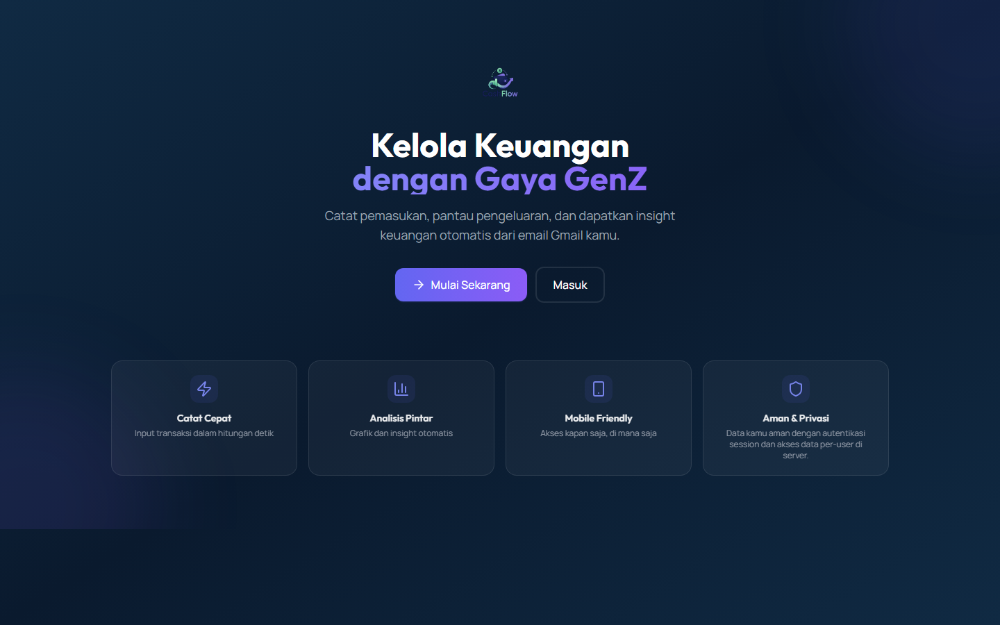
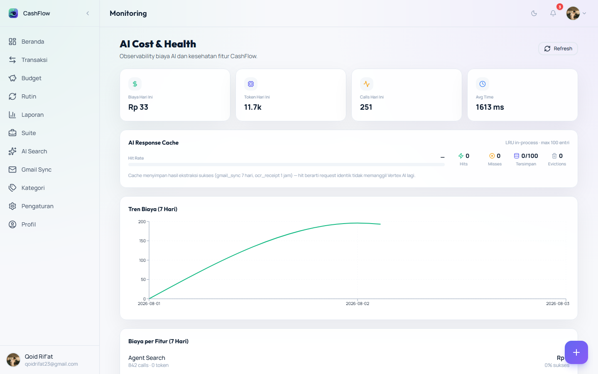
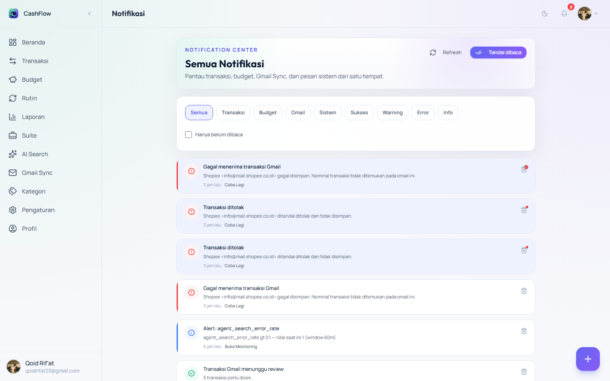
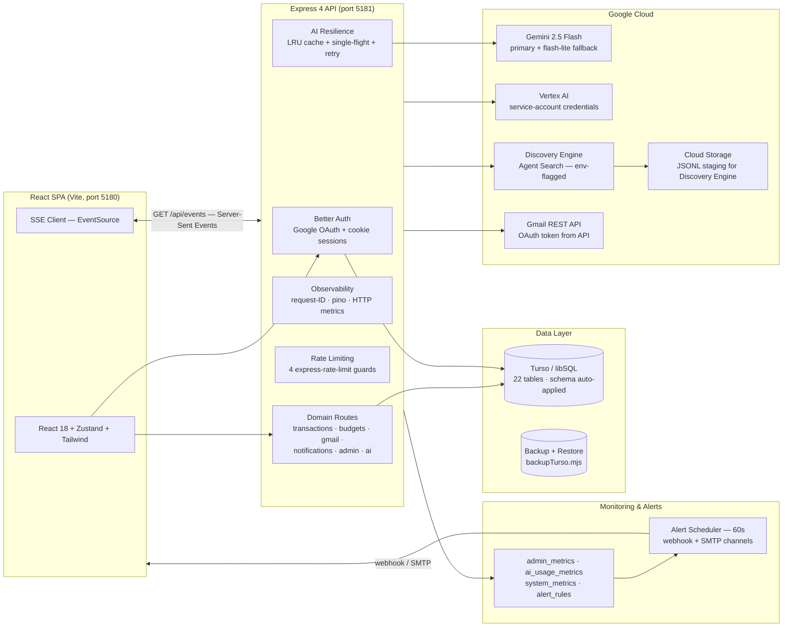

<p align="center">
  
</p>

<p align="center">
  
</p>

<h1 align="center">CashFlow — AI-Native Personal Finance Platform</h1>

<p align="center">
  <strong>Indonesian-first intelligent expense tracker with Gmail auto-sync, receipt OCR, and an AI financial advisor.</strong>
</p>

<p align="center">
  
  
  
  
  
  
  
  
  
  
  
  
</p>

---

## ✨ Overview

**CashFlow** is a full-stack, AI-native personal finance application built for Indonesian users. It turns scattered bank emails and paper receipts into a clean, categorized financial picture — automatically.

Instead of manual data entry, CashFlow **connects to your Gmail inbox**, scans transaction emails, and uses an AI pipeline (Gemini on Vertex AI) to extract and categorize transactions. Items the model isn't confident about land in a **"Perlu Review"** queue where you approve or reject them with one click — and the result is pushed to your notifications in real time over SSE.

### Why was it built?

Manual expense tracking fails because it demands discipline. CashFlow removes the friction: the data arrives automatically, the AI does the heavy lifting, and the human only reviews edge cases.

### Who is it for?

- Individuals who want automated expense tracking from their existing Gmail inbox
- Users who prefer Indonesian-language finance terminology and formatting (Rp, `Diterima`, `Budget`, etc.)
- Developers evaluating a production-grade AI + fintech reference architecture

### Value proposition

| | Manual tracking | CashFlow |
|---|---|---|
| Data entry | Manual, error-prone | **Automatic** via Gmail sync |
| Receipts | Typed by hand | **AI vision extraction** on photo upload |
| Categorization | Manual rules | **AI classification** + human review |
| Insights | None | **Monthly AI reports** + advisor |
| Realtime | — | **SSE push** to dashboard & notifications |

---

## 📸 Screenshots

> All screenshots are captured live from the running application with the Playwright cookie-auth harness (`docs/assets/screenshots/`).

| Light mode | Dark mode | Mobile |
|---|---|---|
|  |  |  |
|  |  |  |
|  |  |  |
|  |  |  |

Full index: [docs/assets/screenshots/INDEX.md](docs/assets/screenshots/INDEX.md) (21 screenshots: landing, login, protected pages, receipt OCR modal, dark mode, mobile).

---

## 🏗 Architecture



- **Frontend** — React 18 SPA, TypeScript strict, react-router-dom v7, Zustand v5 stores, Tailwind design system, dark/light mode, mobile responsive.
- **Backend** — Express 4.22.2 modular API, Better Auth for authentication, helmet, pino structured logs, 4 rate limiters, domain-split route modules.
- **Database** — Turso (libSQL) via Kysely query builder; 22 tables defined in `turso-schema.sql`, auto-applied at boot.
- **Realtime** — Server-Sent Events (SSE) push with 12 event types and 30s heartbeats.
- **AI** — Gemini 2.5 Flash → Flash-lite fallback chain via `@google/genai` + Vertex AI; receipt vision extraction, Gmail classification, monthly insights, Discovery Engine agent search.
- **Observability** — request-ID, pino, HTTP metrics (4xx/5xx/latency), feature & AI usage metrics, alert rules with webhook/SMTP channels.

Detailed design: [docs/system/ARCHITECTURE.md](docs/system/ARCHITECTURE.md)

---

## 🚀 Core Features

| Feature | Description |
|---|---|
| Google OAuth (Better Auth) | Secure session cookies, production-hardened secret handling |
| Dashboard | Balance, statistic cards, quick actions, latest transactions |
| Transaction Management | CRUD, filters, server-side pagination, recurring templates |
| Receipt OCR | Photo upload → Gemini vision extraction → transaction draft |
| Budget Planning | Category budgets with usage tracking |
| Recurring Transactions | Automatic recurring templates (**Rutin**) |
| Reports | Monthly summaries + AI monthly report generation |
| Gmail Sync | Client-driven inbox scan, AI classification, needs-review queue |
| Gmail Review Flow | Approve/reject/duplicate detection with realtime notifications |
| Wallet & Savings Goals | Multi-account wallet, savings goals, subscriptions |
| AI Search (Agent) | Discovery Engine over transactions/gmail/receipts (env-flagged, default off) |
| AI Insights & Advisor | Monthly AI report + financial health score + AI Coach (spending/saving/budget/subscription advice, emergency fund, action list) |
| Fraud Detection | L1 rule engine on every transaction + dashboard widget + notifications (optional L2 AI scoring) |
| Categories | Defaults seeding, CRUD, `isDefault` guard |
| Notifications | In-app bell + realtime SSE push + webhook/SMTP channels |
| Admin Monitoring | Feature health, AI usage, system metrics, cache stats |
| Alert Rules | 60s scheduler + webhook/SMTP (env-gated) notification channels |
| Dark Mode / Mobile | Full theming, hamburger navigation, responsive layouts |

---

## 🤖 AI Architecture

**Model chain:** `gemini-2.5-flash` (primary) → `gemini-2.5-flash-lite` (fallback), called through `@google/genai` against Vertex AI with **service-account credentials only** (no API keys).

### Gmail → Transaction flow
```
Gmail REST API → client-driven scan, newest-first (retroactive backfill = "history" run type)
  → Gemini extracts {amount, merchant, category, date}
  → confidence scoring
    ├─ high confidence   → auto-accepted
    ├─ low confidence    → "Perlu Review" queue
    └─ malformed/duplicate → rejected / dedupe via gmail_message_id
  → approve/reject actions push notifications via SSE + webhook/SMTP
  → background sync is re-scheduled automatically by the client
```

### Receipt scan flow
```
Photo upload → in-memory image compression → Gemini vision extraction
  → confidence-scored candidate → draft transaction form
```

### Monthly insights
```
Aggregated monthly data → Gemini narrative report → Reports page + advisor
```

### Financial Advisor (AI Coach)
```
Transactions/budgets/wallets/goals/subscriptions → client-side metrics (no raw PII)
  → POST /api/gemini/advisor (validated + sanitized) → Gemini structured JSON
  → spending advice · saving strategy · budget strategy · subscription optimization
  → emergency-fund coverage (6-month target) · personalized action list (priority)
  → deterministic rule-based fallback when AI is unavailable (page never breaks)
```

### Fraud detection (rule engine → optional AI scoring)
```
Every transaction write → L1 rule engine (duplicate/velocity/amount-outlier/
new-merchant/category-anomaly) → fraud_flags + notification + dashboard widget
  → optional L2 Gemini risk scoring (FRAUD_AI_SCORING_ENABLED, default off)
  → "Perlu dicek" chip on transactions + admin metric fraud_flag_count
```

### Agent Search flow
```
Query → Discovery Engine (transactions / gmail logs / receipts data stores)
  → embeddings + reranking → grounded answer with sources
  (JSONL documents staged via Cloud Storage and imported into data stores)
```

### Resilience
- **LRU response cache** with hit/miss metrics exposed at `/api/admin/metrics/cache`
- **Single-flight dedup** for identical concurrent requests (anti thundering-herd)
- **Exponential-backoff retry** on quota/timeout errors
- **Rule-based frontend fallback parsers** when a model response can't be parsed

> ⚠️ Legacy note: `GEMINI_API_KEY` is dead config from the pre-Vertex era — it is ignored. All AI calls authenticate via service-account credentials.

---

## 🧰 Tech Stack

**Frontend:** React 18 · TypeScript · Vite 5 · react-router-dom v7 · Zustand v5 · Tailwind CSS · Recharts · Framer Motion · React Hook Form · Zod · Lucide

**Backend:** Node.js ≥ 20 · Express 4.22.2 · Better Auth · Kysely · pino · helmet · cors · express-rate-limit · multer · nodemailer

**Database:** Turso (libSQL) · Kysely query builder

**Cloud & AI:** Gemini via `@google/genai` · Vertex AI · Discovery Engine · Gmail REST API · Cloud Storage (JSONL staging) · Google Auth Library

**Testing & CI:** Playwright (E2E + visual regression + performance) · Vitest · GitHub Actions · `tsc --noEmit` lint/typecheck

---

## 📁 Project Structure

```
├── src/                    # React frontend
│   ├── app/                # App shell, router
│   ├── components/         # Shared UI components
│   ├── config/             # Env, constants, navigation, theme
│   ├── features/           # 15 feature modules (gmail, transactions, admin…)
│   ├── lib/                # AI parsers, classifiers, SSE client
│   ├── pages/              # Page components
│   ├── services/           # API clients (transaction, budget, gmail…)
│   ├── store/              # Zustand stores
│   ├── types/ · utils/     # Shared types & helpers
│   └── styles/             # Global CSS
├── server/                 # Express backend
│   ├── index.js            # App bootstrap (schema auto-apply, AI context)
│   ├── config/             # Runtime configuration
│   ├── routes/             # 11 domain route modules
│   ├── services/           # Business logic (agent search, metrics…)
│   ├── lib/                # Auth, SSE, Vertex AI context, Turso client
│   └── middleware/         # Auth, observability
├── e2e/                    # Playwright E2E suite
│   ├── helpers/            # Session minting, auth context, pagination, realtime
│   ├── visual/             # Visual regression snapshots
│   ├── performance/        # Performance budget tests
│   └── contract/           # API contract tests
├── tests/unit/             # Vitest unit specs (11 files)
├── scripts/                # Schema, seed, backup/restore utilities
├── docs/                   # Enterprise documentation system
│   ├── adr/                # Architecture Decision Records
│   ├── architecture/       # Architecture audit + compliance matrix
│   ├── assets/             # Diagrams & screenshots
│   ├── archive/            # Legacy docs (read-only)
│   ├── e2e/                # E2E strategy, coverage, stability
│   ├── enterprise/         # Enterprise modernization audit (12 docs)
│   ├── gmail-sync/         # Gmail sync checklists & troubleshooting
│   ├── meta/               # Documentation governance
│   └── system/             # Current-state system docs
├── turso-schema.sql        # Canonical DB schema (22 tables)
└── .github/workflows/      # CI pipeline (e2e.yml)
```

---

## 📦 Installation

### Prerequisites
- Node.js ≥ 20, npm ≥ 9
- A Turso database (free tier: https://turso.tech)
- A Google Cloud project with **Vertex AI / Gemini** + **OAuth consent screen** (for Gmail)
- (Optional) Discovery Engine + Cloud Storage bucket for Agent Search

### 1. Clone & install

```bash
git clone https://github.com/qoidrifat/cashflow.git
cd cashflow
npm install
```

### 2. Configure environment

```bash
cp .env.example .env                # frontend flags (VITE_*)
cp server/.env.example server/.env  # backend secrets (see Configuration)
```

### 3. Database schema

The server **auto-applies `turso-schema.sql` (22 tables) at boot** — no manual migration step. To apply explicitly or manage data:

```bash
node scripts/applyTursoSchema.mjs   # idempotent — safe to re-run
node scripts/backupTurso.mjs        # scheduled/one-off dumps
node scripts/restoreTurso.mjs       # restore from a dump
```

### 4. Run (development)

```bash
npm run dev:all          # Vite (5180) + Express API (5181) concurrently
```

Open http://localhost:5180 — sign in with Google.

### 5. Run (production)

```bash
npm run build            # tsc --noEmit + production Vite bundle
npm run dev:server       # serve API; host dist/ with any static server
```

---

## 🔐 Environment Variables

> Never commit real secrets. `.env.example` and `server/.env.example` are templates — copy them and fill in values, or wire a secret manager / GitHub Actions secrets in production.

### Backend (`server/.env`)

| Variable | Required | Purpose |
|---|---|---|
| `TURSO_DATABASE_URL` | ✅ | Turso (libSQL) connection URL |
| `TURSO_AUTH_TOKEN` | ✅ | Turso database auth token |
| `GOOGLE_CLIENT_ID` / `GOOGLE_CLIENT_SECRET` | ✅ | Google OAuth app (Better Auth login + Gmail offline access, `gmail.readonly`) |
| `BETTER_AUTH_SECRET` | ✅ (prod) | Session signing secret — strong & unique in production |
| `BETTER_AUTH_URL` | ✅ | Public URL of the app |
| `BETTER_AUTH_TRUSTED_ORIGINS` | ⚠️ | Extra allowed CORS origins |
| `GOOGLE_CLOUD_PROJECT` / `GCP_PROJECT_ID` | ✅ | Vertex AI / Gemini project |
| `GCP_LOCATION` | ✅ | Vertex AI region (e.g. `us-central1`) |
| `GOOGLE_APPLICATION_CREDENTIALS` | ✅ | Service-account JSON path — the ONLY AI auth path |
| `GEMINI_MODEL` / `GEMINI_PRIMARY_MODEL` | ⚠️ | Primary model (default `gemini-2.5-flash`) |
| `GEMINI_FALLBACK_MODEL` | ⚠️ | Fallback model (default `gemini-2.5-flash-lite`) |
| `ADMIN_EMAILS` | ⚠️ | Comma-separated admin emails — gates `/api/admin/*` |
| `ALERT_WEBHOOK_URL` | ⚠️ | Webhook channel for alert rules (Slack/Discord/generic) |
| `SMTP_HOST` / `SMTP_PORT` / `SMTP_USER` / `SMTP_PASS` / `SMTP_FROM` | ⚠️ | Email channel for alerts (HOST+USER+PASS required, sent to `ADMIN_EMAILS`) & Gmail review results |
| `AGENT_SEARCH_ENABLED` + `AGENT_SEARCH_*` | ⚠️ | Discovery Engine search (project, location, engine, data-store IDs, GCS bucket) — default off |
| `PORT` | ⚠️ | API port (default `5181`) |

### Frontend (`.env`)

| Variable | Purpose |
|---|---|
| `VITE_API_BASE_URL` | Backend base URL (production) |
| `VITE_AGENT_SEARCH_ENABLED` | Toggle agent-search UI |

---

## 📜 Available Scripts

| Script | Description |
|---|---|
| `npm run dev` | Vite dev server on `:5180` |
| `npm run dev:server` | Express API on `:5181` |
| `npm run dev:all` | Both concurrently |
| `npm run build` | `tsc --noEmit` + production Vite build |
| `npm run lint` / `typecheck` | Both run `tsc --noEmit` (no ESLint) |
| `npm run test:unit` | Vitest unit suite (11 specs) |
| `npm run test:e2e` | Playwright E2E (`workers=1`, 3 webServers incl. rate-limit server on `:5182`) |
| `npm run test:e2e:stability` | 3× stability gate (fail only on 3× flaky) |
| `npm run test:e2e:contract` | API contract checks |
| `npm run test:e2e:visual` / `:check` | Regenerate / verify visual baselines |
| `npm run test:e2e:perf` | Performance budget suite |
| `npm run test:e2e:gmail` · `:gmail-review` | Gmail sync & review flows |
| `npm run test:e2e:admin` / `:admin-cache` | Admin metrics & cache panel |
| `npm run test:e2e:ratelimit` | Auth rate-limit guard |

---

## 🗄 Database

- **Engine:** Turso (libSQL) — SQLite-compatible, edge-replicated
- **Query layer:** Kysely (`@libsql/kysely-libsql`)
- **Schema:** `turso-schema.sql` — **22 tables**, auto-applied at server boot (idempotent)
- **Authorization:** Express `requireAuth` middleware + per-route ownership validation — **not** RLS

```
Auth (Better Auth)   user · session · account · verification
User domain          users · user_sessions · profiles
Finance              categories · transactions · budgets · recurring_transactions
Gmail                gmail_sync_logs · gmail_sync_settings · gmail_sync_runs
Wealth               wallet_accounts · saving_goals · subscriptions
Engagement           notifications
Observability        admin_metrics · ai_usage_metrics · system_metrics · alert_rules
```

- **Backup:** `scripts/backupTurso.mjs` — scheduled dumps + documented restore runbook.

---

## 🔐 Authentication

- **Provider:** Better Auth (server-side sessions, database-backed). **No Supabase anywhere.**
- **Login:** Google OAuth with **offline access** + `gmail.readonly` scope (`socialProviders.google`)
- **Cookies:** `httpOnly` session cookie; `useSecureCookies: true` in production; `trustedOrigins` configurable via env
- **Authorization:** `requireAuth` middleware sets `req.user` from the verified session; every domain route validates resource ownership; `ADMIN_EMAILS` gates admin endpoints (403 for non-admins, 401 for anonymous)
- **Rate limiting:** 4 `express-rate-limit` guards across auth + sensitive endpoints (429 after burst)
- **Session lifecycle:** expiry + auto-logout dialog, explicit E2E-tested

---

## 📬 Realtime (SSE)

Live updates are pushed over **Server-Sent Events** — no polling, no WebSockets.

- **Endpoint:** `GET /api/events` (authenticated)
- **Client:** browser-native `EventSource` with built-in auto-reconnect + connection indicator in the UI
- **Heartbeat:** `: heartbeat` comment frame every **30 seconds** to keep proxies from dropping idle connections
- **Delivery:** events are scoped per-user; approving/rejecting Gmail items and admin alerts fan out through the same channel

**12 event types** across transaction, category, budget, recurring, notification, wallet, goal, subscription, and gmail events:

```
transaction:created · transaction:updated · transaction:deleted
category · budget · recurring · wallet · goal · subscription events
notification:new
gmail events (sync completed / review needed)
```

Consumed by the dashboard, notification bell, and Gmail review flows — UI state refreshes the moment the server commits.

---

## 📊 Monitoring & Alerts

- **Admin metrics API:** 7 endpoints under `/api/admin/metrics/*` (feature usage, AI usage, system, cache, alerts, …) — gated by `ADMIN_EMAILS`
- **Alert scheduler:** evaluates `alert_rules` every **60 seconds**
- **Channels:** webhook (`ALERT_WEBHOOK_URL`) + SMTP email to `ADMIN_EMAILS` (env-gated: requires `SMTP_HOST`/`SMTP_USER`/`SMTP_PASS`), with cooldown between firings
- **Seeded rules:** AI cost threshold, failure-rate threshold, cache hit-rate threshold
- **Observability:** request-ID middleware, pino structured logs, HTTP metrics (4xx/5xx/latency)
- **Admin dashboard:** `/admin/monitoring` — summary cards, feature health, alert history, cache panel

---

## 🛡 Security

- Better Auth signed sessions, secure cookies, admin email allow-list
- Helmet security headers, CORS restricted to trusted origins, request size limits (multer)
- 4 rate limiters on auth + sensitive endpoints
- Per-route ownership validation — users can only read/modify their own data
- PII minimized: AI prompts receive transaction data only; Gmail OAuth tokens stay server-side; receipt images processed in-memory, never stored
- Secret hygiene: `server/.env` git-ignored; CI uses GitHub secrets; secret-scan stage on every commit
- Graceful shutdown (SIGINT/SIGTERM), structured error handling

---

## ⚡ Performance

- Server-side pagination on transactions & Gmail logs (indexed, bounded queries)
- LRU AI response cache + single-flight dedup (identical concurrent requests coalesce)
- Lazy chunking via Vite (route-level code splitting)
- CI performance budget (Ubuntu runner, real measurements): page load DOM < 3000ms, API p95 < 1800ms, pagination soft/hard 6000/12000ms, ≤ 60 requests/page

---

## ✅ Testing

| Layer | Tool | Scope |
|---|---|---|
| Unit | Vitest | 11 specs — parsers, validators, mappers, cache, single-flight, pagination |
| API contract | Playwright | Schema-drift detection against live routes |
| E2E | Playwright | `workers=1`, 3 webServers (Vite `:5180`, API `:5181`, rate-limit test server `:5182`) — auth gates, Gmail review flows, realtime notifications, rate limit, admin |
| Visual regression | Playwright | Snapshot baselines × light/dark/desktop/mobile |
| Performance | Playwright | Budget assertions on page load, API latency, pagination |

**Stability gate:** `scripts/e2e-stability-gate.sh` runs the E2E suite up to 3× in CI; the job fails only if all attempts fail — flakes are surfaced as warnings, not hidden.

---

## 🚢 Deployment & CI

- **CI:** `.github/workflows/e2e.yml` — 4 jobs:
  1. Lint · Typecheck · Build (`tsc --noEmit` + Vite)
  2. Playwright E2E (stability gate 3×) with seeded CI database
  3. Visual Regression (Ubuntu)
  4. Performance Budget
- Artifacts: HTML reports, traces, screenshots, perf JSON
- **CI database:** separate Turso DB seeded deterministically via `scripts/seedE2eDataset.mjs` — dev data is never mixed into CI
- **Production:** build static bundle + run Express API; set production secrets; schedule `backupTurso.mjs`

---

## 🗺 Roadmap

**✅ Completed**
- Full Supabase → **Better Auth + Turso** migration (auth, DB, monitoring) and decommission — Supabase Edge Functions removed
- Enterprise E2E modernization: stability gate, visual regression, performance budget, CI pipeline
- Sprint 0–4: rate limiting, backup/restore, observability (request-ID, pino), AI resilience (cache + single-flight + retry), bundle optimization
- Gmail review flow (approve/reject/duplicate/amount) with realtime + webhook/SMTP notifications

**🔄 In progress**
- `server/index.js` modularization debt (route modules per domain)
- Sprint 1.4 AI Search enhancements (semantic filtering, suggested queries, search history)
- Sprint 1.5–1.8 UX polish, empty states, performance audit

**🔭 Future**
- Sprint 2: semantic cache L3 (embedding-aware), multi-model router architecture, cost monitoring, AI evaluation
- Sprint 3–5: production deployment, beta & public release
- Smart AI router + semantic cache + anomaly detection (3/6/12-month enterprise roadmap in `docs/enterprise/AI_EVOLUTION_ROADMAP.md`)

---

## 📚 Documentation

The repository maintains an enterprise documentation system — every folder has an index, decisions are recorded as ADRs, and legacy content is archived (never deleted).

| Hub | Purpose |
|---|---|
| **[Documentation Map](docs/DOCUMENTATION_MAP.md)** | Single navigation hub — start here |
| **[System docs](docs/system/INDEX.md)** | Current-state architecture, audit report, feature matrix |
| **[ADRs](docs/adr/INDEX.md)** | Why-decisions (Better Auth, Turso, SSE, AI, monitoring…) |
| **[E2E docs](docs/e2e/INDEX.md)** | Testing strategy, coverage, stability, CI |
| **[Enterprise docs](docs/enterprise/INDEX.md)** | Modernization audit + AI roadmap |
| **[Architecture & audit](docs/architecture/INDEX.md)** | Architecture & implementation compliance (+ [security](docs/security/INDEX.md), [performance](docs/performance/INDEX.md)) |
| **[Gmail sync](docs/gmail-sync/)** | Sync checklists, troubleshooting, optimization |
| **[Meta docs](docs/meta/INDEX.md)** | Documentation governance (style guide, naming) |
| **[Archive](docs/archive/ARCHIVE.md)** | Historical/legacy documentation (read-only) |

---

## 🤝 Contributing

Please read our **[Contributing Guide](CONTRIBUTING.md)** — it covers local setup, test commands, the mandatory quality gate, and **secret hygiene**.

Quick checklist for every PR:
1. Fork the repository and create a feature branch
2. Add tests for new behavior (unit for helpers, E2E for user flows)
3. Run the quality gate before opening a PR:
   ```bash
   npm run lint && npm run typecheck && npm run build
   npm run test:unit
   npm run test:e2e
   ```
4. CI runs the same gates plus visual regression and performance budget

Also see our [Code of Conduct](CODE_OF_CONDUCT.md) and, for security issues, [SECURITY.md](SECURITY.md) — **report vulnerabilities privately**.

---

## 📝 Changelog

See [CHANGELOG.md](CHANGELOG.md) for the version history (backfilled from the initial 45 commits into [v1.0.0](https://github.com/qoidrifat/cashflow/releases/tag/v1.0.0)).

---

## 📄 License

Released under the [MIT License](LICENSE) — free to use, modify, and distribute. © 2026 Qoid Rif'at.

---

## 📬 Contact

- **Repository:** [github.com/qoidrifat/cashflow](https://github.com/qoidrifat/cashflow)
- **Maintainer:** Qoid Rif'at
- **Documentation:** [docs/DOCUMENTATION_MAP.md](docs/DOCUMENTATION_MAP.md)
