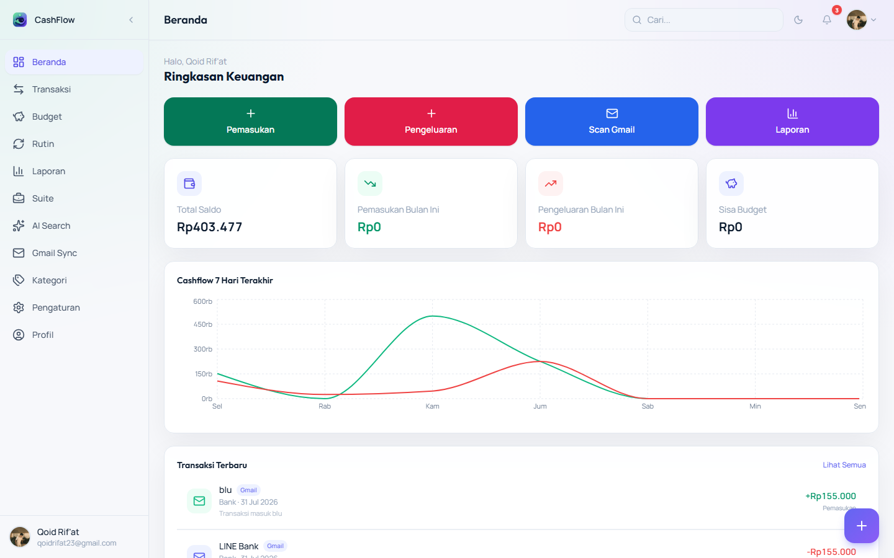
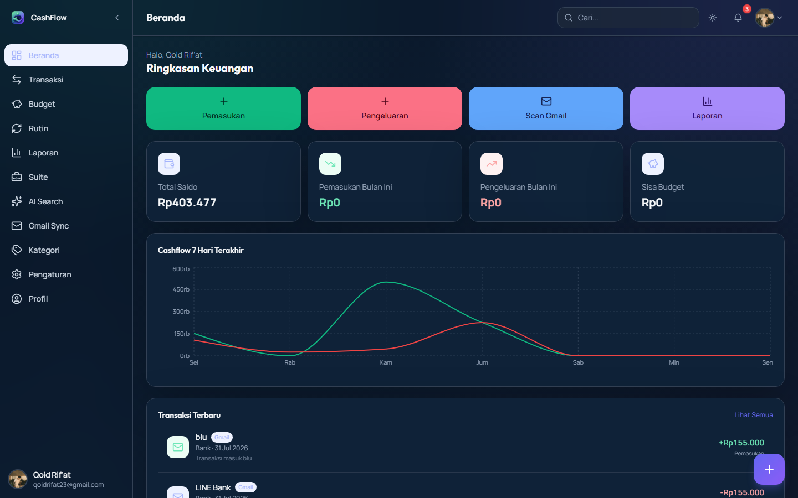
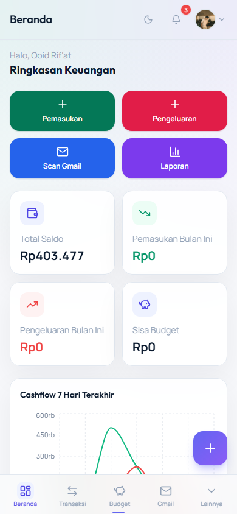
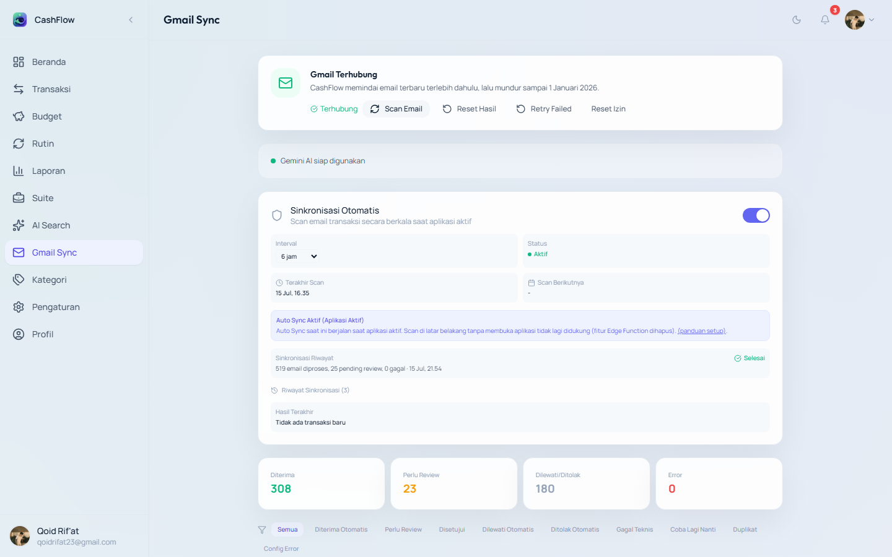
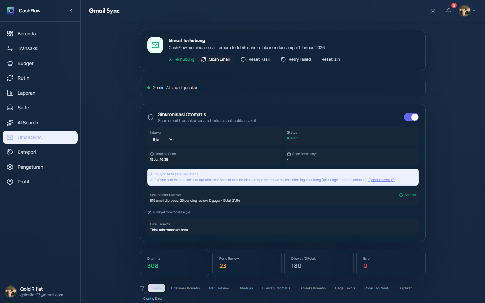
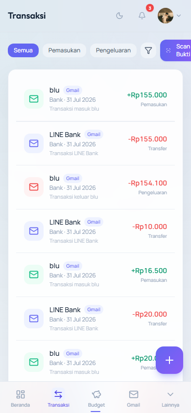
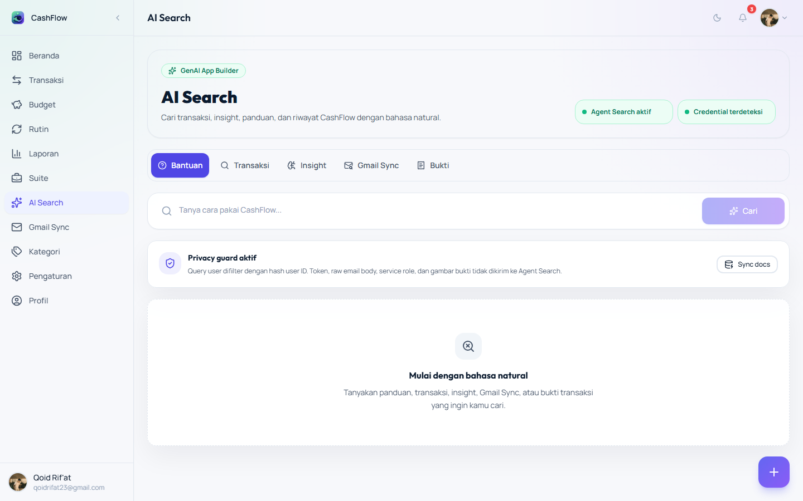
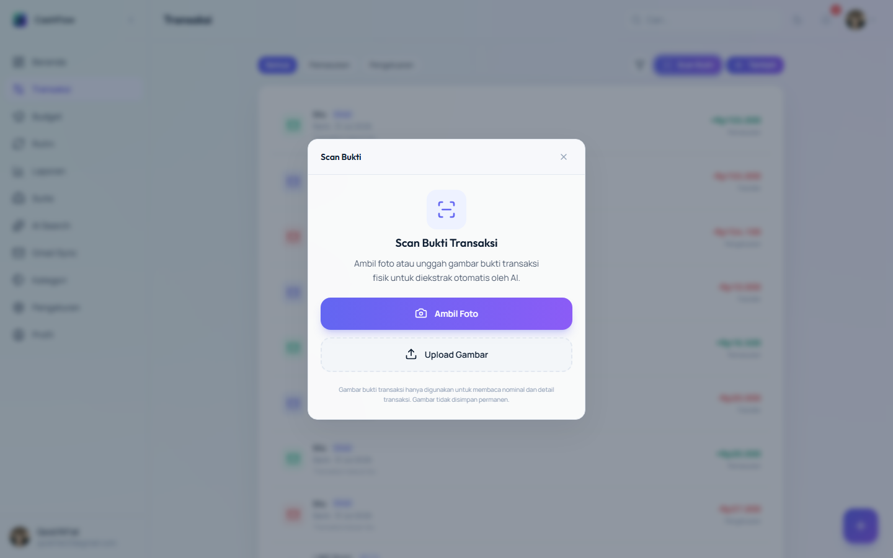
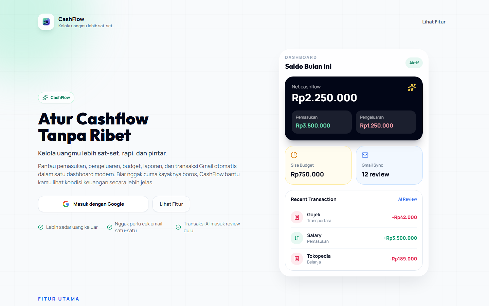
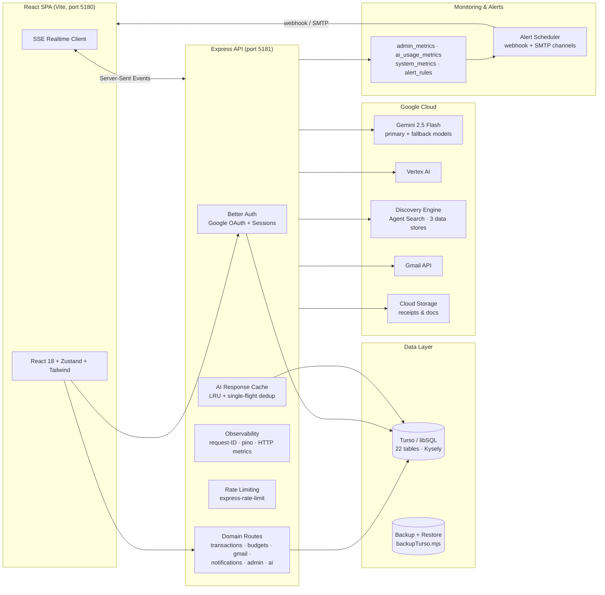

<p align="center">
  
</p>

<h1 align="center">CashFlow — AI-Native Personal Finance Platform</h1>

<p align="center">
  <strong>Indonesian-first intelligent expense tracker with Gmail auto-sync, receipt OCR, and an AI financial advisor.</strong>
</p>

<p align="center">
  
  
  
  
  
  
  
  
  
  
  
  
</p>

---

## ✨ Overview

**CashFlow** is a full-stack, AI-native personal finance application built for Indonesian users. It turns scattered bank emails and paper receipts into a clean, categorized financial picture — automatically.

Instead of manual data entry, CashFlow **connects to your Gmail inbox**, scans transaction emails, and uses an AI classification pipeline (Gemini + Vertex AI) to extract and categorize transactions. Items the model isn't confident about land in a **"Perlu Review"** queue where you approve or reject them with one click — and the result is pushed to your notifications in real time.

### Why was it built?

Manual expense tracking fails because it demands discipline. CashFlow removes the friction: the data arrives automatically, the AI does the heavy lifting, and the human only reviews edge cases.

### Who is it for?

- Individuals who want automated expense tracking from their existing Gmail inbox
- Users who prefer Indonesian-language finance terminology and formatting (Rp, `Diterima`, `Budget`, etc.)
- Developers evaluating a production-grade AI + fintech reference architecture

### Value proposition

| | Manual tracking | CashFlow |
|---|---|---|
| Data entry | Manual, error-prone | **Automatic** via Gmail sync |
| Receipts | Typed by hand | **OCR** on photo upload |
| Categorization | Manual rules | **AI classification** + human review |
| Insights | None | **Monthly AI reports** + advisor |
| Realtime | — | **SSE push** to dashboard & notifications |

---

## 📸 Screenshots

> All screenshots are captured live from the running application with the Playwright cookie-auth harness (`docs/assets/screenshots/`).

| Light mode | Dark mode | Mobile |
|---|---|---|
|  |  |  |
|  |  |  |
|  |  |  |

Full index: [docs/system/SCREENSHOT_INDEX.md](docs/system/SCREENSHOT_INDEX.md) (21 screenshots: landing, login, 14 protected pages, receipt OCR modal, dark mode, mobile).

---

## 🏗 Architecture



- **Frontend** — React 18 SPA, TypeScript strict, Zustand stores, Tailwind design system, dark/light mode, mobile responsive.
- **Backend** — Express 5 modular API, Better Auth for authentication, domain-split route modules.
- **Database** — Turso (libSQL) via Kysely query builder; embedded SQLite-compatible, edge-friendly.
- **Realtime** — Server-Sent Events (SSE) push for live notification updates.
- **AI** — Gemini (primary/fallback), Vertex AI, Discovery Engine agent search, OCR, monthly reports.
- **Observability** — request-ID, pino structured logs, HTTP metrics (4xx/5xx/latency), feature & AI usage metrics, alert rules with webhook/SMTP channels.

Detailed design: [docs/system/ARCHITECTURE.md](docs/system/ARCHITECTURE.md)

---

## 🚀 Features

| Feature | Status | Description |
|---|---|---|
| Google OAuth (Better Auth) | ✅ Implemented | Secure session cookies, production-hardened secret handling |
| Dashboard | ✅ Implemented | Balance, statistic cards, quick actions, latest transactions |
| Transaction Management | ✅ Implemented | CRUD, filters, server-side pagination, recurring templates |
| Receipt OCR | ✅ Implemented | Photo upload → AI extraction → transaction draft |
| Budget Planning | ✅ Implemented | Category budgets with usage tracking |
| Recurring Transactions | ✅ Implemented | Automatic recurring templates (Rutin) |
| Reports | ✅ Implemented | Monthly summaries + AI monthly report generation |
| Gmail Sync | ✅ Implemented | Scans inbox, AI classification, needs-review queue |
| Gmail Review Flow | ✅ Implemented | Approve/reject/duplicate detection with realtime notifications |
| Wallet & Savings Goals | ✅ Implemented | Multi-account wallet, savings goals, subscriptions |
| AI Search (Agent) | ✅ Implemented | Discovery Engine over transactions/gmail/receipts |
| AI Insights & Advisor | ✅ Implemented | Monthly AI report + financial advisor |
| Categories | ✅ Implemented | Defaults seeding, CRUD, `isDefault` guard |
| Notifications | ✅ Implemented | In-app bell + realtime SSE push + webhook/SMTP channels |
| Realtime Updates | ✅ Implemented | SSE push, reconnect handling, connection indicator |
| Admin Monitoring | ✅ Implemented | Feature health, AI usage, system metrics, cache stats |
| Alert Rules | ✅ Implemented | Scheduler + webhook/SMTP notification channels |
| Dark Mode | ✅ Implemented | Full theming across all pages |
| Mobile Responsive | ✅ Implemented | Hamburger navigation, responsive layouts |

---

## 🤖 AI Pipeline

### Gmail → Transaction flow
```
Gmail API → scan newest-first (back to Jan 1, 2026)
  → AI classifier (Gemini) extracts {amount, merchant, category, date}
  → confidence scoring
    ├─ high confidence  → auto-accepted
    ├─ low confidence   → "Perlu Review" queue
    └─ malformed/duplicate → rejected / dedupe via gmail_message_id
  → approve/reject actions push notifications via SSE + webhook/SMTP
```

### Receipt OCR flow
```
Photo upload → image compression → Vertex/Gemini extraction
  → confidence-scored candidate → draft transaction form
```

### Agent Search flow
```
Query → Discovery Engine (transactions / gmail logs / receipts data stores)
  → embeddings + reranking → grounded answer with sources
```

### Insight / Monitoring flow
```
Every AI call records {feature, user, tokens, latency, cost} → ai_usage_metrics
  → admin_metrics aggregates → alert_rules evaluate on schedule
  → trigger webhook/SMTP channel when a rule fires
```

### AI Resilience
- **LRU response cache** with hit/miss metrics exposed at `/api/admin/metrics/cache`
- **Single-flight dedup** for identical concurrent requests (anti thundering-herd)
- **Exponential backoff retry** for `VERTEX_QUOTA_EXCEEDED` / `VERTEX_TIMEOUT`
- **Fallback parser** when the primary Gemini response can't be parsed

---

## 🧰 Tech Stack

**Frontend:** React 18 · TypeScript · Vite · Tailwind CSS · Zustand · React Router · Recharts · Framer Motion · React Hook Form · Zod · Lucide

**Backend:** Node.js · Express 5 · Better Auth · Kysely · pino · helmet · cors · express-rate-limit · multer · nodemailer

**Database:** Turso (libSQL) · Kysely query builder

**Cloud & AI:** Google Gemini · Vertex AI · Discovery Engine · Gmail API · Cloud Storage · Google Auth Library

**Testing & CI:** Playwright (E2E + visual regression + performance) · Vitest (unit) · GitHub Actions · ESLint/tsc

---

## 📁 Project Structure

```
├── src/                    # React frontend
│   ├── app/                # App shell, router
│   ├── config/             # Env, constants, navigation, theme
│   ├── features/           # Feature modules (gmail, transactions, admin…)
│   ├── lib/                # AI parsers, classifiers, SSE client
│   ├── pages/              # Page components
│   ├── services/           # API clients (transaction, budget, gmail…)
│   ├── store/              # Zustand stores
│   └── styles/             # Global CSS
├── server/                 # Express backend
│   ├── index.js            # App bootstrap
│   ├── routes/             # Domain route modules
│   ├── services/           # Business logic (agent search, metrics…)
│   ├── lib/                # Auth, SSE, Vertex AI context, Turso client
│   └── middleware/         # Auth, observability
├── e2e/                    # Playwright E2E suite
│   ├── helpers/            # Session minting, auth context, pagination, realtime
│   ├── visual/             # Visual regression (10 snapshots)
│   ├── performance/        # Performance budget tests
│   └── contract/           # API contract tests
├── scripts/                # Seed, backup, migration utilities
├── docs/                   # Architecture, audit, E2E documentation
│   ├── enterprise/         # Enterprise modernization audit (11 docs)
│   ├── audit/              # Implementation audit + compliance matrix
│   ├── e2e/                # E2E strategy, coverage, stability reports
│   └── system/             # System audit (this rebuild)
├── turso-schema.sql        # Canonical DB schema (22 tables)
└── .github/workflows/      # CI pipeline (e2e.yml)
```

---

## 📦 Installation

### Prerequisites
- Node.js ≥ 20
- npm ≥ 9
- A Turso database (free tier: https://turso.tech)
- A Google Cloud project with **Gemini API** + **OAuth consent screen** (for Gmail)
- (Optional) Discovery Engine + Cloud Storage for AI Search

### 1. Clone & install

```bash
git clone https://github.com/qoidrifat/cashflow.git
cd cashflow
npm install
```

### 2. Configure environment

```bash
cp .env.example .env                # frontend flags (VITE_*)
cp server/.env.example server/.env  # backend secrets (see below)
```

### 3. Apply the database schema

```bash
node scripts/applyTursoSchema.mjs   # creates all 22 tables in Turso (idempotent — safe to re-run)
```

### 4. Run (development)

```bash
npm run dev:all          # Vite (5180) + Express API (5181) concurrently
```

Open http://localhost:5180 — sign in with Google.

### 5. Run (production build)

```bash
npm run build            # typecheck + production bundle
npm run dev:server       # serve API; serve dist/ with any static host
```

---

## 🔐 Environment Variables

> Never commit real secrets. Use a secret manager (or GitHub Actions secrets) in production.

### Backend (`server/.env`)

| Variable | Required | Purpose |
|---|---|---|
| `TURSO_DATABASE_URL` | ✅ | Turso (libSQL) connection URL |
| `TURSO_AUTH_TOKEN` | ✅ | Turso database auth token |
| `GOOGLE_CLIENT_ID` / `GOOGLE_CLIENT_SECRET` | ✅ | Google OAuth app (Better Auth + Gmail) |
| `BETTER_AUTH_SECRET` | ✅ (prod) | Session signing secret — must be strong & unique in production |
| `BETTER_AUTH_URL` | ✅ | Public URL of the app (e.g. `https://cashflow.example.com`) |
| `ADMIN_EMAILS` | ⚠️ | Comma-separated admin emails (admin monitoring access) |
| `GEMINI_API_KEY` | ✅ | Gemini API key (primary model) |
| `GEMINI_PRIMARY_MODEL` / `GEMINI_FALLBACK_MODEL` | ⚠️ | Model names; fallback enables resilience |
| `GOOGLE_CLOUD_PROJECT` / `GCP_PROJECT_ID` / `GCP_LOCATION` | ⚠️ | Vertex AI project context |
| `GOOGLE_APPLICATION_CREDENTIALS` | ⚠️ | Service-account JSON path (Agent Search / Storage) |
| `AGENT_SEARCH_ENABLED` + `AGENT_SEARCH_*` (project, location, engine, data-store IDs, buckets) | ⚠️ | Discovery Engine agent search |
| `ALERT_WEBHOOK_URL` | ⚠️ | Webhook channel for alert rules (Slack/Discord/generic) |
| `GMAIL_WEBHOOK_URL` / `SMTP_HOST` / `SMTP_USER` / `SMTP_PASS` | ⚠️ | External channels for Gmail review results |
| `PORT` | ⚠️ | API port (default `5181`) |

### Frontend (`.env`)

| Variable | Purpose |
|---|---|
| `VITE_FUNCTIONS_BASE_URL` | Backend base URL (production) |
| `VITE_AGENT_SEARCH_ENABLED` | Toggle agent-search UI |
| `VITE_AI_SEARCH_ROUTE_ENABLED` | Toggle AI Search route |

---

## 📜 Available Scripts

| Script | Description |
|---|---|
| `npm run dev` | Vite dev server on `:5180` |
| `npm run dev:server` | Express API on `:5181` |
| `npm run dev:all` | Both concurrently |
| `npm run build` | `tsc --noEmit` + production Vite build |
| `npm run lint` / `typecheck` | TypeScript strict check |
| `npm run test:unit` | Vitest unit suite (113 tests) |
| `npm run test:e2e` | Playwright E2E (41 tests, 14 specs + 1 contract) |
| `npm run test:e2e:stability` | 3× stability gate (fail only on 3× flaky) |
| `npm run test:e2e:contract` | API contract checks (9) |
| `npm run test:e2e:visual` / `:check` | Regenerate / verify visual baselines (10 snapshots) |
| `npm run test:e2e:perf` | Performance budget suite |
| `npm run test:e2e:gmail` | Gmail Sync E2E |
| `npm run test:e2e:gmail-review` | Gmail review flows (approve/reject/duplicate/amount) |
| `npm run test:e2e:admin` / `:admin-cache` | Admin metrics & cache panel |
| `npm run test:e2e:ratelimit` | Auth rate-limit guard |

---

## 🗄 Database

- **Engine:** Turso (libSQL) — SQLite-compatible, edge-replicated
- **Query layer:** Kysely (`@libsql/kysely-libsql`)
- **Schema:** `turso-schema.sql` (canonical) — **22 tables**

```
Auth (Better Auth)   user · session · account · verification
User domain          users · user_sessions · profiles
Finance              categories · transactions · budgets · recurring_transactions
Gmail                gmail_sync_logs · gmail_sync_settings · gmail_sync_runs
Wealth               wallet_accounts · saving_goals · subscriptions
Engagement           notifications
Observability        admin_metrics · ai_usage_metrics · system_metrics · alert_rules
```

- **Backup:** `scripts/backupTurso.mjs` — scheduled dumps + documented restore runbook.

---

## 🔐 Authentication

- **Provider:** Better Auth (server-side sessions, database-backed)
- **Login:** Google OAuth (`socialProviders.google`)
- **Cookies:** `httpOnly` session cookie; `useSecureCookies: true` in production; `trustedOrigins` configurable via env
- **Authorization:** middleware sets `req.user` from the verified session; `ADMIN_EMAILS` gates admin endpoints (403 for non-admins, 401 for anonymous)
- **Rate limiting:** `express-rate-limit` on auth endpoints (429 after burst)
- **Session lifecycle:** expiry + auto-logout dialog, explicit E2E-tested

---

## 📊 Monitoring & Alerts

- **Feature metrics:** per-feature call counts (`admin_metrics`)
- **AI usage:** tokens, latency, cost per call (`ai_usage_metrics`)
- **System metrics:** `system_metrics` (memory/CPU snapshots)
- **Cache stats:** hit/miss rate exposed at `/api/admin/metrics/cache`
- **Alert rules:** `alert_rules` evaluated by an in-process scheduler → webhook / SMTP channels with cooldown
- **Observability:** request-ID middleware, pino structured logs, HTTP metrics (4xx/5xx/latency)
- **Admin dashboard:** `/admin/monitoring` — summary cards, feature health, alert history, cache panel

---

## 🛡 Security

- Better Auth signed sessions, secure cookies, admin email allow-list
- Helmet security headers, CORS restricted, request size limits (multer)
- Rate limiting on auth + sensitive endpoints
- PII minimized: AI prompts receive transaction data only; Gmail tokens server-side only
- Secret hygiene: `server/.env` git-ignored; CI uses GitHub secrets; secret-scan stage on every commit
- Graceful shutdown (SIGINT/SIGTERM), structured error handling

---

## ⚡ Performance

- Server-side pagination on transactions & Gmail logs (indexed, bounded queries)
- LRU AI response cache + single-flight dedup (identical concurrent requests coalesce)
- Lazy chunking via Vite (route-level code splitting)
- CI performance budget (Ubuntu runner, real measurements): page load DOM < 3000ms, API p95 < 1800ms, pagination soft/hard 6000/12000ms, ≤ 60 requests/page — **measured margins are 2–10× under budget**

---

## ✅ Testing

| Layer | Tool | Scope |
|---|---|---|
| Unit | Vitest | 113 tests — parsers, validators, mappers, pagination helpers |
| API contract | Playwright | 9 checks — detects schema drift automatically |
| E2E | Playwright | 41 tests / 14 specs + 1 contract — auth gates, Gmail review flows, realtime notifications, rate limit, admin |
| Visual regression | Playwright | 10 snapshots × light/dark/desktop/mobile — data-driven masks |
| Performance | Playwright | Budget assertions on page load, API latency, pagination |

**Stability gate:** the E2E suite runs up to 3× in CI; the job fails only if all attempts fail — flakes are surfaced as warnings, not hidden. Verified **0 flaky across 3 consecutive local runs**.

---

## 🚢 Deployment & CI

- **CI:** `.github/workflows/e2e.yml` — 4 jobs:
  1. Lint · Typecheck · Build
  2. Playwright E2E (stability gate 3×) with seeded CI database
  3. Visual Regression (10 snapshots on Ubuntu)
  4. Performance Budget
- Artifacts: HTML reports, traces, screenshots, perf JSON
- **CI database:** separate Turso DB seeded deterministically (284 transactions, 519 Gmail logs) via `scripts/seedE2eDataset.mjs` — dev data is never mixed into CI
- **Production:** build static bundle + run Express API; set production secrets; scheduled `backupTurso.mjs`

---

## 🗺 Roadmap

**✅ Completed**
- Full Supabase → **Better Auth + Turso** migration (auth, DB, monitoring) and decommission
- Enterprise E2E modernization: 41 tests, visual regression, performance budget, CI pipeline
- Sprint 0–4: rate limiting, backup/restore, observability (request-ID, pino), AI resilience (cache + single-flight + retry), bundle optimization
- Gmail review flow (approve/reject/duplicate/amount) with realtime + webhook/SMTP notifications

**🔄 In progress**
- `server/index.js` modularization debt (route modules per domain)

**🔭 Future**
- Unit tests for remaining pure helpers; CI-isolated DB seed hardening
- Smart AI router + semantic cache + anomaly detection (3/6/12-month enterprise roadmap in `docs/enterprise/AI_EVOLUTION_ROADMAP.md`)

---

## 📚 Documentation

The repository maintains an enterprise documentation system — every folder has an index, decisions are recorded as ADRs, and legacy content is archived (never deleted).

| Hub | Purpose |
|---|---|
| **[Documentation Map](docs/DOCUMENTATION_MAP.md)** | Single navigation hub — start here |
| **[System docs](docs/system/INDEX.md)** | Current-state architecture, audit report, feature matrix |
| **[ADRs](docs/adr/INDEX.md)** | Why-decisions (Better Auth, Turso, SSE, AI, monitoring…)
| **[E2E docs](docs/e2e/INDEX.md)** | Testing strategy, coverage, stability, CI |
| **[Enterprise docs](docs/enterprise/INDEX.md)** | Modernization audit + AI roadmap |
| **[Architecture & audit](docs/architecture/INDEX.md)** | Architecture & implementation compliance (+ [security](docs/security/INDEX.md), [performance](docs/performance/INDEX.md)) |
| **[Meta docs](docs/meta/INDEX.md)** | Documentation governance (style guide, naming) |
| **[Archive](docs/archive/ARCHIVE.md)** | Historical/legacy documentation (read-only) |

## 🤝 Contributing

Please read our **[Contributing Guide](CONTRIBUTING.md)** — it covers local setup, test commands, the mandatory quality gate, and **secret hygiene**.

Quick checklist for every PR:
1. Fork the repository and create a feature branch
2. Add tests for new behavior (unit for helpers, E2E for user flows)
3. Run the quality gate before opening a PR:
   ```bash
   npm run lint && npm run typecheck && npm run build
   npm run test:unit
   npm run test:e2e
   ```
4. CI runs the same gates plus visual regression and performance budget

Also see our [Code of Conduct](CODE_OF_CONDUCT.md) and, for security issues, [SECURITY.md](SECURITY.md) — **report vulnerabilities privately**.

## 📝 Changelog

See [CHANGELOG.md](CHANGELOG.md) for the version history (backfilled from the initial 45 commits into [1.0.0]).

---

## 📄 License

Released under the [MIT License](LICENSE). © 2026 Qoid Rif'at.

You are free to use, modify, and distribute this software. Attribution is appreciated but not required.

---

## 📬 Contact

- **Repository:** [github.com/qoidrifat/cashflow](https://github.com/qoidrifat/cashflow)
- **Maintainer:** Qoid Rif'at
- **Documentation:** [docs/DOCUMENTATION_MAP.md](docs/DOCUMENTATION_MAP.md)
