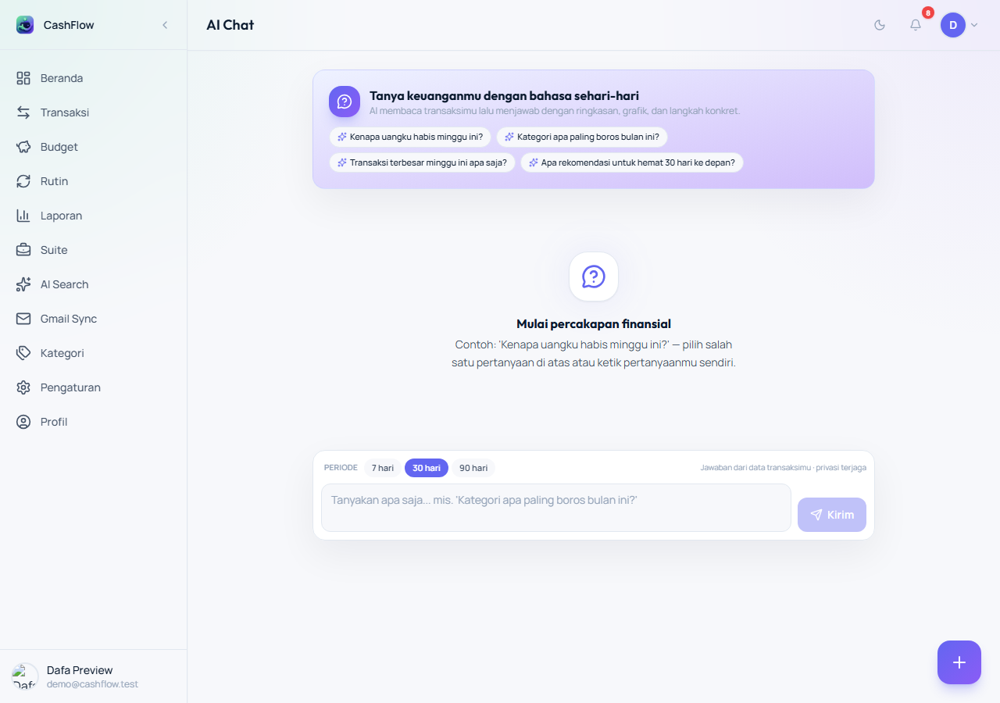
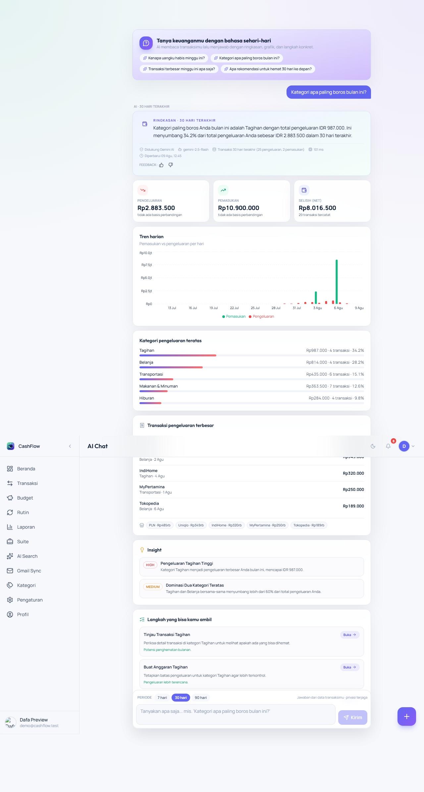
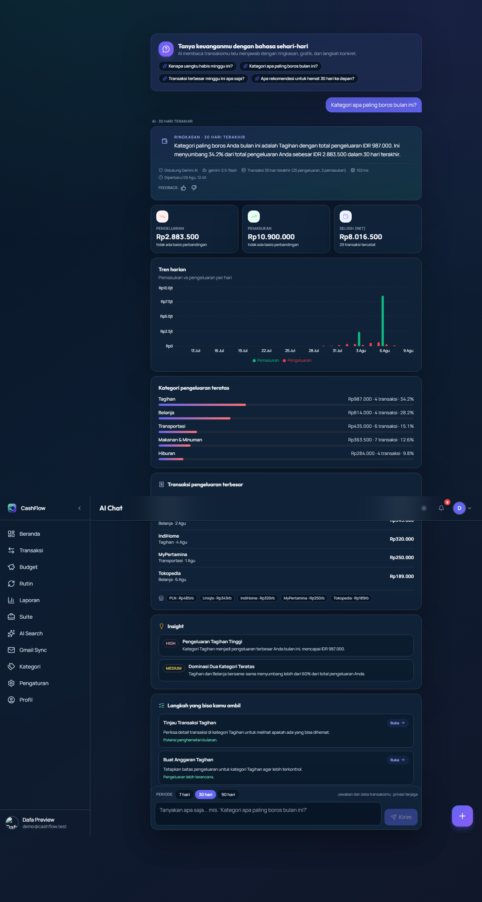
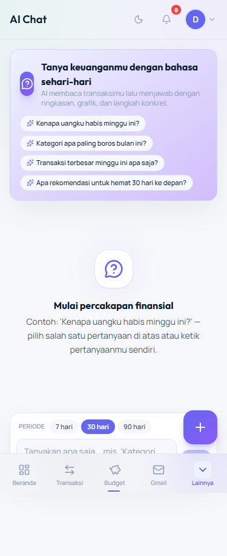
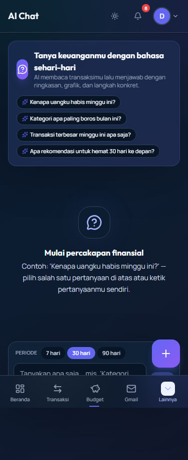

# AI Conversation — Natural Conversation (P8)

> **Sprint 1.5 · Phase 8** · Status: **Diterapkan** · 2026-08-07
> Percakapan finansial bahasa sehari-hari dengan **jawaban kaya**: ringkasan → grafik → kategori → transaksi → insight → aksi.

## 1. Tujuan

User bertanya dengan bahasa natural — *"Kenapa uangku habis minggu ini?"* — dan AI menjawab bukan hanya teks, tetapi **menghubungkan data**: angka kunci, grafik harian, kategori teratas, transaksi terbesar, insight, dan langkah aksi yang bisa diklik. Semua berbasis **data transaksi nyata user**, bukan generik.

## 2. Arsitektur

```
User (AiConversationPage /ai/chat)
  │  POST /api/ai-product/conversation  { query, periodDays }
  ▼
conversationRoutes.js  (requireAuth · validasi P1-2)
  │  1 query: SELECT transaksi user periode + periode sebelumnya
  ▼
lib/conversationAggregator.js  ← DETERMINISTIK MURNI (tanpa I/O)
  computeDateRange · aggregateConversationStats · buildConversationPrompt
  buildConversationFallback · normalizeConversationNarrative
  ▼
Gemini (generateGeminiText, feature='conversation', cache 1 jam)
  │  → parseGeminiResponse → normalizeConversationNarrative (anti-prompt-injection)
  │  └─ gagal/tidak valid → buildConversationFallback (rule-based, TIDAK pernah raw error)
  ▼
Response JSON: stats + chart.daily + categories + topMerchants +
              topTransactions + narrative (summary/insights/recommendations) + trust
  └─ fire-and-forget: record ke ai_timeline (feature='conversation')
```

**Trust model** ikut P10: `source` (`gemini` | `rule-based`), `model`, `processingTimeMs`, `dataCoverage`, `timestamp`, `fallbackReason`. UI menampilkannya via `AiTrustMeta` + `AiFeedbackButtons` (feedback masuk `ai_feedback` sebagai dataset evaluasi).

## 3. Agregasi (lib/conversationAggregator.js)

Semua fungsi **pure & deterministik** — unit-testable tanpa DB/Gemini:

| Fungsi | Peran |
|---|---|
| `computeDateRange(periodDays, now)` | rentang periode + periode sebelumnya (inklusif, key lokal `YYYY-MM-DD`) |
| `conversationPeriodLabel(days)` | label "7 hari terakhir" / "30 hari terakhir" / "3 bulan terakhir" |
| `sanitizeConversationName(value, max)` | buang control char, collapse spasi, cap panjang, fallback "Lainnya" — anti prompt-injection konten user |
| `aggregateConversationStats(rows, range)` | income/expense/net + prev, delta % (null bila prev=0), seri harian lengkap (0 untuk hari kosong), kategori (pct & count), merchant teratas, transaksi terbesar |
| `buildConversationPrompt(...)` | prompt Gemini gaya `buildAdvisorPrompt` — output SATU JSON, aturan ketat, anti-halusinasi (data disanitasi & di-cap) |
| `buildConversationFallback(...)` | narasi deterministik bila Gemini gagal/tidak ada data — selalu ramah user |
| `normalizeConversationNarrative(data)` | sanitasi output AI: cap string, array ≤3, severity di-enum, **href di-whitelist** |

**Delta %**: `(cur - prev) / prev × 100`, 1 desimal; `null` bila periode sebelumnya 0 (tidak ada basis — UI menampilkan "tidak ada basis perbandingan").

## 4. API

`POST /api/ai-product/conversation` (requireAuth)

```jsonc
// body
{ "query": "Kenapa uangku habis minggu ini?", "periodDays": 7 }   // periodDays opsional: 7|30|90, default 30
```

Respons berisi `stats`, `chart.daily` (7–90 titik income/expense), `categories` (≤8, pct), `topMerchants` (≤5), `topTransactions` (≤5), `narrative` (summary ≤3 kalimat, insights ≤3, recommendations ≤3 dengan `href` whitelist `/transactions | /budgets | /advisor | /ai | /reports`), dan `trust`.

**Validasi** (pola P1-2): `query` wajib ≤200 char; `periodDays` harus **angka** 7|30|90 (string `'30'` ditolak) → 400 `VALIDATION_ERROR`, bukan 401.

## 5. Keamanan & Privasi

- `requireAuth` — query selalu `WHERE user_id = ?` (user-scoped).
- Nama kategori/merchant/note **disanitasi** sebelum masuk prompt (anti prompt-injection dari konten transaksi).
- Output AI **dinormalisasi**: href rekomendasi di-whitelist (tidak ada link arbitrer), severity di-enum, string di-cap.
- Cache 1 jam memakai `buildAICacheKey` berbasis prompt lengkap (termasuk statistik) — pertanyaan sama + data sama → hit; tidak ada cache lintas-user (key berisi data user).
- Kegagalan Gemini **tidak pernah** menampilkan raw error — fallback rule-based dengan `trust.fallbackReason`.
- Tidak menambahkan secret/endpoint baru yang mengekspos prompt internal.

## 6. UI (/ai/chat)

- **Suggested queries** (4 chip) → sekali klik langsung tanya.
- **Period selector** 7/30/90 hari.
- **Bubble user** (kanan, primary) & **jawaban AI** (kiri, card kaya).
- **Skeleton** saat AI memproses (spinner + chart skeleton) — tidak ada loading kosong.
- **Error state + tombol "Coba lagi"** — retry memakai query & periode sama.
- Jawaban: summary card (+trust +feedback) → 3 tile angka kunci (Pengeluaran/Pemasukan/Net + badge delta) → **BarChart harian** (recharts, shared chunk dinamis — tidak menambah entry chunk) → kategori (bar pct) → transaksi terbesar → insight (badge severity) → rekomendasi aksi (link whitelist).
- Entry points: nav "AI Chat" (`/ai/chat`) + CTA "Tanya AI" di hero AI Hub.

### Screenshot

**Desktop light — state awal** (hero + suggested queries + komposer):



**Desktop light — jawaban rich** (setelah submit "Kategori apa paling boros bulan ini?"): ringkasan → angka kunci → grafik harian → kategori → transaksi → aksi:



**Desktop dark — jawaban rich**:



**Mobile (375×812)** — state awal & dark:





> Tangkapan layar: sesi Dafa Preview, 2026-08-09 — dapat diregenerasi via `npm run capture:ai` (+ `--chat-answer` untuk varian jawaban; lihat `docs/system/SCREENSHOT_INDEX.md`).

## 7. Test

`tests/unit/conversationAggregator.test.ts` — **23 test**: date range, label, sanitasi, agregasi (split current/prev, delta null, seri harian lengkap, kategori/merchant/transaksi), fallback (tanpa data & dengan data), normalisasi narrative (cap, whitelist href, enum severity, potong array), prompt (memuat query/label, tanpa id mentah), dan `CONVERSATION_CREATE_SCHEMA` (query wajib ≤200, periodDays ketat).

**Verifikasi**: unit 584 passed · typecheck 0 · lint 0 · build 9.9s (entry 103 kB, recharts tetap chunk dinamis) · probe live tanpa auth → 401.

## 8. Roadmap setelahnya

- Session state percakapan multi-turn (konteks jawaban sebelumnya) — desain sudah disiapkan via `messages[]` di client.
- Injeksi AI Memory (P7) ke konteks pertanyaan agar jawaban makin personal.
- Feedback `conversation` masuk dataset evaluasi benchmark.
