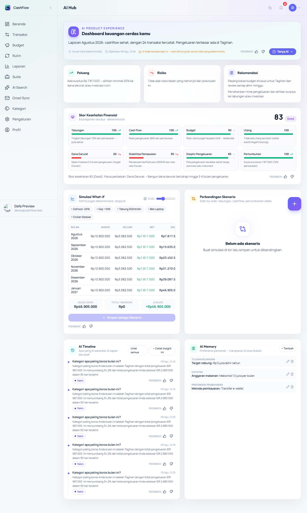
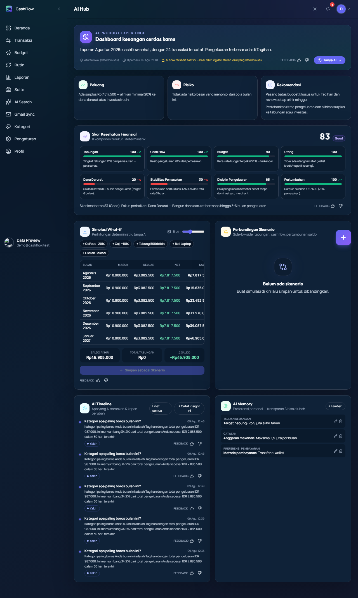
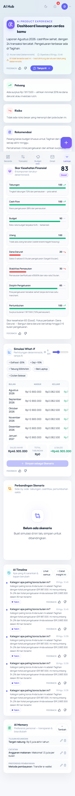
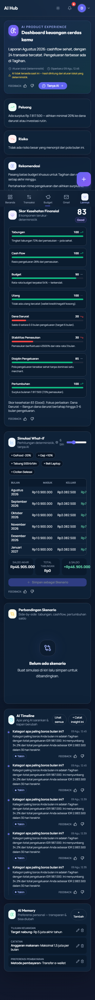

# AI Dashboard (AI Hub)

> **Sprint 1.5 Phase 9** — Dashboard AI khusus (bukan dashboard transaksi) di `/ai`.

## 1. Isi Halaman

| Bagian | Phase | Isi |
|---|---|---|
| **Hero** | P9 | Today's insight summary + trust meta + feedback |
| **Mini Cards** | P9 | Peluang (saving opportunities), Risiko (top risks), Rekomendasi |
| **Health Score Card** | P6 | 8 subscore + kategori + trend + feedback |
| **Simulasi What-if** | P4 | preset adjustment + slider bulan + tabel proyeksi + stat |
| **Perbandingan Skenario** | P5 | side-by-side table + skor dampak |
| **AI Timeline** | P3 | riwayat rekomendasi + tombol catat + feedback |
| **AI Memory** | P7 | preferensi editable/deletable/transparan |

### Screenshot

**Desktop light** — hero insight, mini cards Peluang/Risiko/Rekomendasi, skor kesehatan, simulasi what-if, timeline & memory:

**Desktop dark** — varian gelap (kontras surface dipertahankan):

**Mobile (375×812)** — layout satu kolom; tabel simulasi memakai scroll internal (`min-w-0` fix 2026-08-09 — tanpa ini tabel memaksa card melebar melampaui viewport):

> Tangkapan layar: sesi Dafa Preview, 2026-08-09 — dapat diregenerasi via `npm run capture:ai` (lihat `docs/system/SCREENSHOT_INDEX.md`).

## 2. Mengapa Halaman Terpisah

Dashboard transaksi = data mentah. AI Hub = **interpretasi & keputusan**:
- Today's Insight (ringkasan bulan ini)
- Prediction (simulasi ke depan)
- Opportunities / Risk (dari insight fallback)
- Progress (health score + trend)
- Learning (feedback + memory)
- Confidence (badge interpretasi)

## 3. Data

Halaman memuat data yang sama dengan AdvisorPage (transactions via SSE listener, budgets, wallets, goals, subscriptions) lalu:
- `computeAdvisorMetrics` → baseline + input health
- `buildFallbackMonthlyReport` → insight cards (deterministik)
- `runSimulation` / `computeFinancialHealth` → engine murni
- `listTimeline` / `listMemory` → server API

## 4. Route & Navigasi

- Route: `/ai` (lazy-loaded di `router.tsx`, di bawah AuthGuard).
- Navigasi: `moreMenuNav` → **AI Hub** (ikon BrainCircuit).

## 5. Performance

- Semua engine O(months × adjustments) — murni aritmetika, tidak ada fetch AI.
- Timeline/Memory fetch sekali saat mount.
- Komponen memakai pola selector store (`useAuthStore((s) => s.authUser)`) — konsisten dengan baseline performa React.
