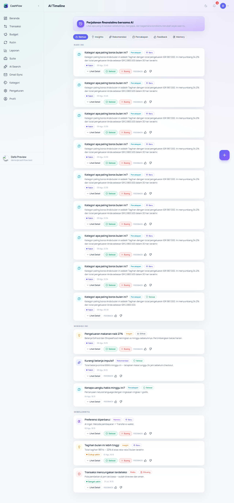
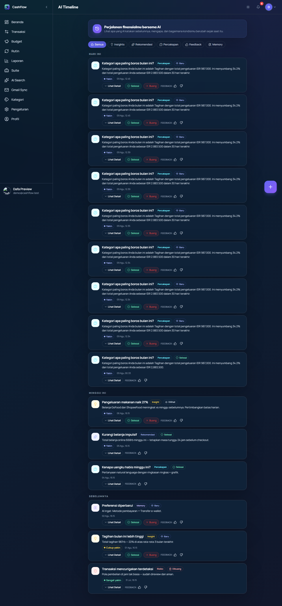
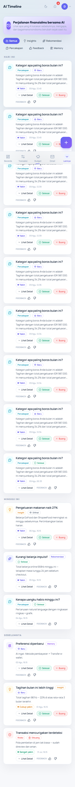
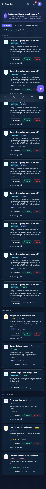
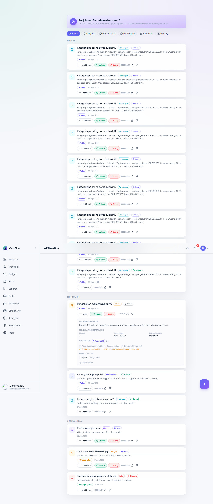
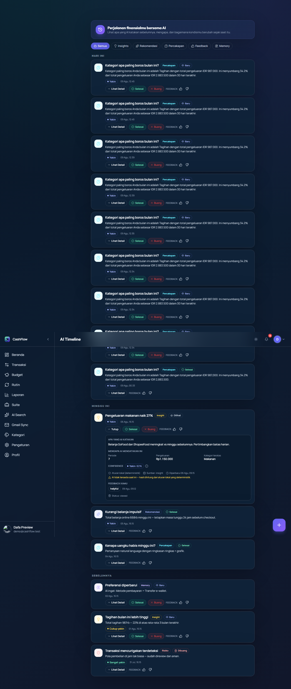
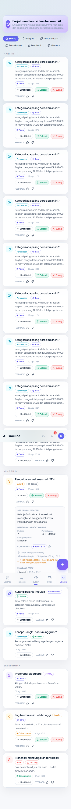
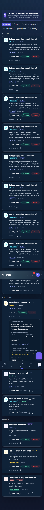

# AI Timeline & Longitudinal Financial Intelligence (P9)

> **Sprint 1.5 — P9** · Status: **Diterapkan** · Tanggal: 2026-08-07
> Mengubah AI CashFlow dari *stateless AI response* menjadi *context-aware longitudinal assistant*:
> user dapat melihat apa yang AI katakan sebelumnya, kapan, berdasarkan data apa, bagaimana kondisi berubah,
> apakah feedback diberikan, dan apakah rekomendasi sudah ditindaklanjuti.

## 1. Konsep

Timeline menjawab pertanyaan: *"AI sebelumnya mengatakan X, kemudian kondisiku berubah menjadi Y."*

```
Senin      💡 Insight: Pengeluaran makanan +27% (vs minggu sebelumnya)   [Baru]
Rabu       💬 Percakapan: Kenapa uangku habis minggu ini?                [Dilihat]
Kamis      👍 Feedback: Membantu  (terkait insight Senin)                [Selesai]
```

Setiap entri menyimpan **snapshot ringkas** (bukan raw response) sehingga perubahan antar
periode dapat dijelaskan & diverifikasi oleh user.

## 2. Model Data

Tabel `ai_timeline` (tidak ada tabel baru — reuse tabel existing, P9 §7):

| Kolom | Arti |
|---|---|
| `id` | UUID |
| `user_id` | user-scoped (FK users; SETIAP query menyertakan `WHERE user_id = ?`) |
| `feature` | `advisor` \| `insight` \| `fraud` \| `search` \| `ocr` \| `health` \| `simulation` \| `memory` \| `conversation` |
| `event_type` | **P9**: `insight` \| `recommendation` \| `conversation` \| `feedback` \| `memory_update` \| `risk` \| `other` |
| `status` | **P9**: `new` \| `viewed` \| `completed` \| `dismissed` (state machine deterministik) |
| `title` | Judul singkat |
| `body` | Isi rekomendasi/insight (≤ 2000) |
| `confidence` | 0-1 **atau null** (tidak pernah dikarang — P9 §11) |
| `payload` | Snapshot JSON ≤ 8KB (primitives saja — evidence P9 §10) |
| `created_at` | Timestamp otomatis |

Migrasi idempotent untuk DB lama:

```sql
ALTER TABLE ai_timeline ADD COLUMN event_type TEXT NOT NULL DEFAULT 'other';
ALTER TABLE ai_timeline ADD COLUMN status TEXT NOT NULL DEFAULT 'new';
```

### State machine status (P9 §12)

```
new ──→ viewed ──→ completed
 │                └─→ dismissed
 └─────→ completed
 └─────→ dismissed
```

Transisi deterministik (`server/lib/timelineEvents.js → canTransition`):
`new→viewed|completed|dismissed` · `viewed→completed|dismissed` · `completed/dismissed` = **final**.
Transisi tidak valid → `400 VALIDATION_ERROR`. No-op (status sama) ditolak.

### Event type dari feature

| Feature | event_type |
|---|---|
| advisor, health, simulation | `recommendation` |
| insight, search, ocr | `insight` |
| conversation | `conversation` |
| memory | `memory_update` |
| fraud | `risk` |
| (builder) feedback | `feedback` |
| lainnya | `other` |

`event_type` dihitung **server-side** (klien tidak bisa set sendiri — validateBody membuang field tak dikenal).

## 3. API

Semua endpoint `requireAuth` + user-scoped.

| Method | Path | Keterangan |
|---|---|---|
| GET | `/api/ai-product/timeline` | Pagination **keyset**: `?feature=&eventType=&before=<created_at>&limit=` (default 20, clamp 1-100) → `{ items, hasMore }` (DESC by created_at, id) |
| GET | `/api/ai-product/timeline/:id` | Detail event + feedback terkait (`ai_feedback WHERE item_id = :id`) → `{ ...event, feedback: [...] }` |
| POST | `/api/ai-product/timeline` | Tambah entri (event_type dihitung server; status `new`) |
| PATCH | `/api/ai-product/timeline/:id/status` | Transisi status (state machine) `{ status }` |
| POST | `/api/ai-product/feedback` | **P9**: otomatis merekam event `feedback` bila `itemId` BUKAN timeline event (korelasi via `item_id` = tanpa duplikat, P9 §13) |
| POST | `/api/ai-product/memory` | **P9**: otomatis merekam event `memory_update` (action `set`) |
| DELETE | `/api/ai-product/memory/:id` | **P9**: merekam event `memory_update` (action `delete`) |

### Pagination keyset

```
WHERE user_id = ? [AND feature = ?] [AND event_type = ?]
  [AND (created_at < ? OR (created_at = ? AND id < ?))]
ORDER BY created_at DESC, id DESC LIMIT limit+1   -- hasMore = baris kelebihan
```

Komposit `(created_at, id)` menangani tie created_at (SQLite `datetime('now')` resolusi 1 detik).

## 4. Producer otomatis (P9 §7 — INSIGHT/RECOMMENDATION/CONVERSATION/FEEDBACK/MEMORY_UPDATE)

| Sumber | Tempat | event_type | Fire-and-forget |
|---|---|---|---|
| Natural Conversation | `conversationRoutes.js` | conversation | ✅ |
| Insight bulanan (Gemini) | `geminiRoutes.js` monthly-report | insight | ✅ (body = summary, confidence null) |
| Financial Advisor (Gemini) | `geminiRoutes.js` advisor | recommendation | ✅ (body = summary) |
| Feedback (tanpa itemId timeline) | `aiProductRoutes.js` feedback | feedback | ✅ |
| Memory upsert / delete | `aiProductRoutes.js` memory | memory_update | ✅ |

Semua pencatatan **fire-and-forget** — kegagalan tidak pernah menggagalkan respons AI (pola `recordTimeline`).

## 5. UI — `/ai/timeline`

Halaman **AI Timeline** (route lazy `ai/timeline`, nav "AI Timeline" di Lainnya):

- **Filter**: Semua / Insights / Rekomendasi / Percakapan / Feedback / Memory (chips)
- **Grouping tanggal**: Hari Ini → Kemarin → Minggu Ini → Sebelumnya (`src/lib/timelineGroup.ts`, murni)
- **Kartu event**: ikon event_type, judul, isi (line-clamp), badge confidence ber-interpretasi, status chip, timestamp
- **Detail view**: Apa yang AI katakan · Mengapa (evidence dari payload) · Confidence + interpretasi · Sumber · Kapan dibuat · Status · **Feedback terkait** · tombol aksi
- **Aksi status**: `Selesai` / `Buang` (state machine; optimistic update + rollback)
- **Feedback**: tombol 👍/👎 per event (`itemId = event.id`) — otomatis terkait (P9 §13)
- **Pagination**: tombol "Muat lebih" (keyset `before`)
- Empty state & error state + retry

AiHubPage: kartu **AI Timeline** kini menampilkan 5 entri terbaru feature terkait + link **"Lihat semua"** ke `/ai/timeline`.

### Screenshot — daftar event

**Light mode** — daftar kronologis dengan filter chips, grouping tanggal (Hari Ini/Kemarin/Minggu Ini/Sebelumnya), kartu event ber-ikon, badge confidence, dan status chip:



**Dark mode** — varian yang sama pada tema gelap (kontras surface & border dipertahankan):



**Mobile (375×812)** — daftar event pada viewport mobile, light & dark (layout responsif: filter chips wrap, kartu satu kolom):





### Screenshot — detail view

**Light mode** — detail event: "Apa yang AI katakan" · "Mengapa AI mengatakan ini" (evidence dari payload) · Confidence + interpretasi · Sumber · Status · tombol aksi Selesai/Buang · feedback terkait:



**Dark mode** — detail view pada tema gelap:



**Mobile (375×812)** — detail view pada viewport mobile, light & dark (evidence grid 2 kolom, aksi status & feedback tetap terjangkau):





> Tangkapan layar: desktop 1280 (fullPage) & mobile 375×812, sesi Dafa Preview, 2026-08-09 — dapat diregenerasi via `npm run capture:ai` (lihat `docs/system/SCREENSHOT_INDEX.md`).

## 6. Observability (P9 §23)

`system_metrics` (non-PII, pola existing):

| Metric | Saat |
|---|---|
| `timeline_view` | GET list |
| `timeline_event_open` | GET detail |
| `timeline_status_update` | PATCH status (metadata `{from, to}`) |

## 7. Evidence model (P9 §10)

Payload menyimpan **primitives ringkas** — bukan raw response. Contoh:

```json
{ "periodDays": 7, "expense": 1250000, "topCategory": "Makanan" }
```

UI detail menampilkan sebagai "Mengapa AI mengatakan ini". `sanitizePayload` membuang
nested object/fungsi/array > 8 item & men-cap string (payload ≤ 8KB).

## 8. Keamanan

- Seluruh query: `WHERE user_id = ?` (user-scoped — event user lain → 404, bukan leak).
- Tidak menyimpan raw model response / prompt internal / chain-of-thought.
- `event_type` & `status` divalidasi enum (fail-closed).
- Tidak ada PII di observability.

## 9. Roadmap (tidak di sprint ini)

- Diff otomatis payload antar event ("confidence lama 0.8 → baru 0.9", "spending −16%").
- Feedback → *candidate memory* (P9 §14) — aturan konservatif (feedback "lebih suka cash" → kandidat memory; "insight salah" → bukan).
- Retention & completion analytics (lihat `PRODUCT_METRICS.md`).
