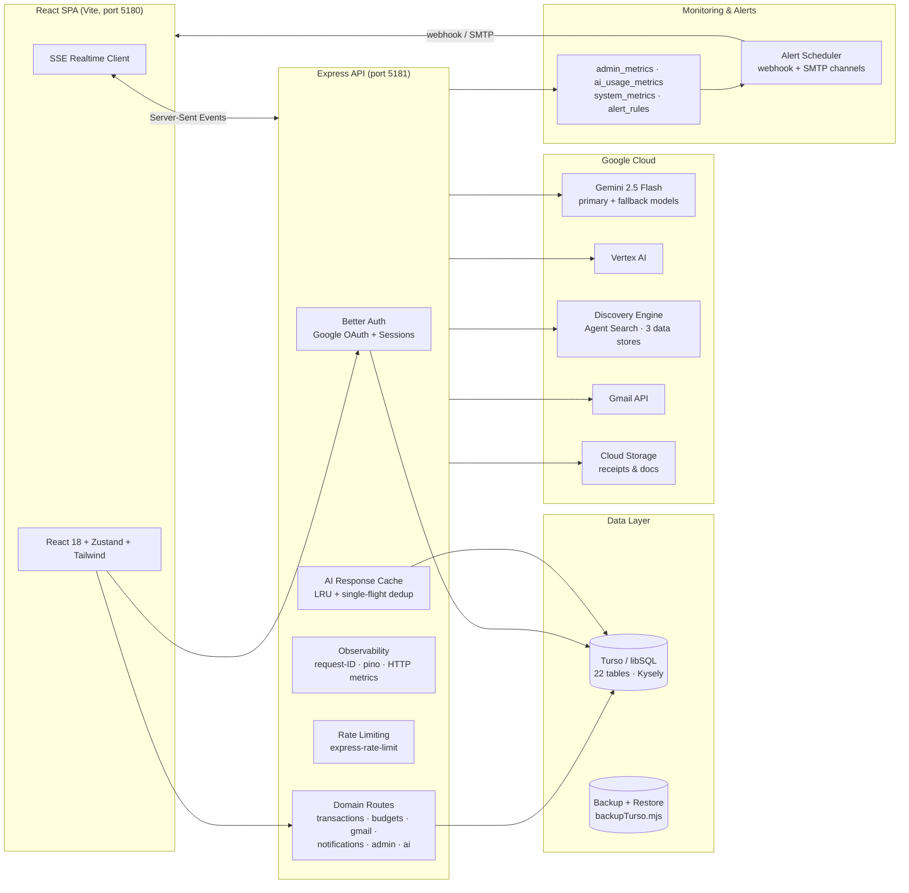
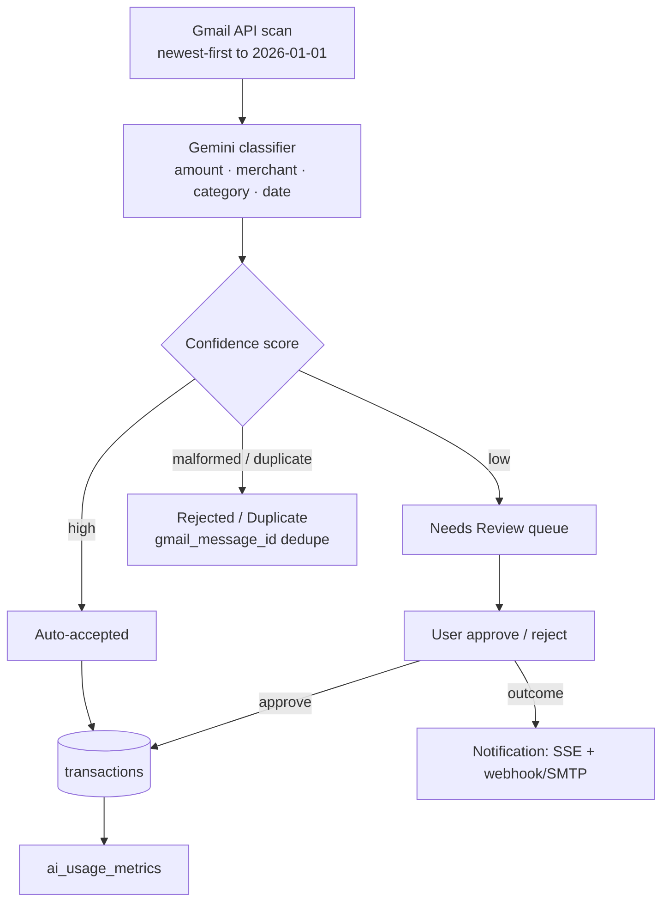
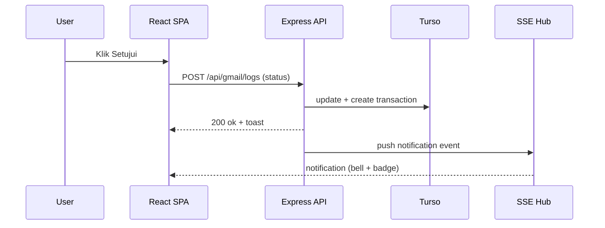

# Canonical Architecture Diagrams

> **Status:** Approved · **Version:** 1.0 · **Owner:** Core Engineering · **Last Updated:** 2026-08-04
> **Related:** [README](../../../README.md) (embedded copy), [docs/system/ARCHITECTURE.md](../../system/ARCHITECTURE.md)

These are the canonical Mermaid sources. Embed them in prose docs via ` ```mermaid ` fences.

## 1. System Architecture



## 2. AI Pipeline — Gmail → Transaction



## 3. Sequence — Review Approve


