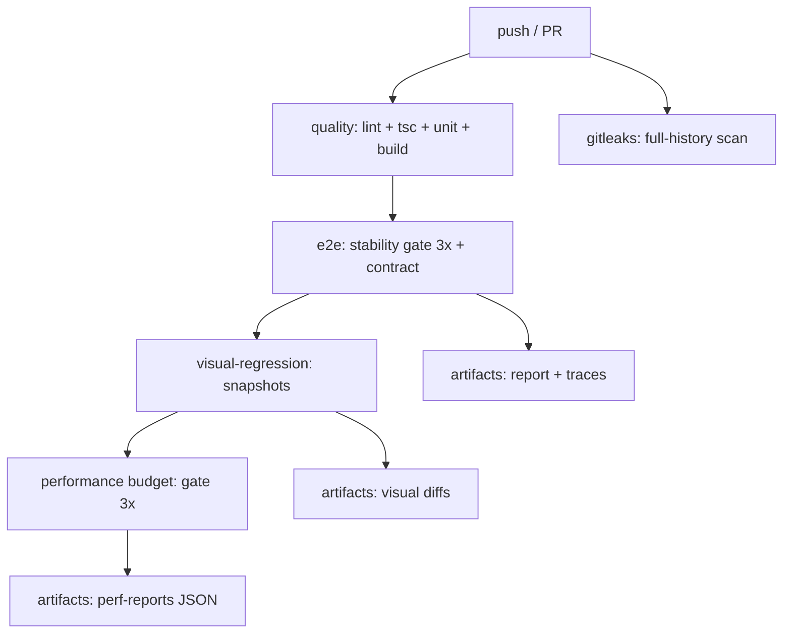

# CI Architecture

> **Date:** 2026-08-06 · **Author:** DevOps audit (Sprint 0.7)
> **Scope:** `.github/workflows/e2e.yml` + built-in Pages workflow
> **Goal:** Pipeline 100% deterministic — baseline resmi sebelum Sprint 1 (AI features)

---

## 1. Overview

CashFlow memakai **satu workflow** `.github/workflows/e2e.yml` dengan 5 job + workflow Pages bawaan GitHub. Tidak ada matrix (larangan arsitektural: semua job menyentuh DB Turso bersama → serialisasi wajib).

| Job | Trigger | Needs | Durasi khas | Gate |
|---|---|---|---|---|
| `quality` (Lint · Typecheck · Build) | setiap push/PR | — | ~3 menit | lint, `tsc` src, typecheck e2e, unit 471, build |
| `gitleaks` (secret scan) | setiap push/PR | — | ~1 menit | full-history secret scan |
| `e2e` (Playwright) | push/PR | `quality` | ~10–12 menit | stability gate 3× (50 test) + contract 10 |
| `visual-regression` | push/PR | `quality`, `e2e` | ~4 menit | snapshot check (10 baseline) |
| `performance` (budget) | push/PR | `quality`, `e2e`, `visual-regression` | ~5 menit | stability gate 3× (3 spec) |
| Pages (built-in) | push ke `gh-pages`/`main` | — | ~1 menit | deploy SPA + `.nojekyll` |

## 2. Dependency Diagram



**Job DB-heavy berjalan SERIAL** (`needs` berantai: quality → e2e → visual → performance). Ini keputusan sadar: semua job memakai DB Turso yang sama (mint session + cleanup + seed) dan webServer port yang sama. Dua instance Playwright paralel pada DB yang sama = race session (aturan proyek, lihat komentar `concurrency` di e2e.yml).

## 3. Serialization & Concurrency

```yaml
concurrency:
  group: e2e-${{ github.actor == 'dependabot[bot]' && 'dependabot' || 'normal' }}
  cancel-in-progress: true
```

- **Hanya 2 group**: `normal` (semua push/PR) dan `dependabot` (terisolasi).
- Push + PR pada ref berbeda **tetap terserialisasi** (bukan per-ref) — keduanya menyentuh DB yang sama.
- Run dependabot hanya menjalankan `quality` + `gitleaks` (tidak menyentuh DB/secrets) sehingga aman di group terpisah. Sebelum pemisahan ini, PR dependabot membatalkan run push yang sah via `cancel-in-progress`.

## 4. Toolchain

| Komponen | Nilai | Alasan |
|---|---|---|
| Node | **24** (env `NODE_VERSION`) | Node 20 EOL Apr 2026; toolchain tervalidasi di v24.15.0 |
| actions/checkout | **v5** | runtime Node 24 (bukan v4 yang Node 20) |
| actions/setup-node | **v5** | `cache: npm` + `node-version` |
| actions/upload-artifact | **v6** | mempertahankan `retention-days`/`if-no-files-found` (v7 menghapus keduanya) |
| actions/cache | **v6** | Playwright browser cache antar job (e2e → visual → perf) |
| Gitleaks | binary v8.30.1 (curl pin) | Tanpa lisensi (action resmi butuh lisensi); pin manual |

## 5. Secrets Exposure (least privilege)

| Job | Secrets | Catatan |
|---|---|---|
| quality, gitleaks | — | bersih dari secret |
| e2e, visual, performance | `TURSO_DATABASE_URL`, `TURSO_AUTH_TOKEN`, `GEMINI_API_KEY` | hanya di job yang butuh DB/AI |
| `ADMIN_EMAILS` | fallback `e2e-seed-admin@cashflow.test` | konsisten dengan seed user |

`permissions: contents: read` di level workflow (least privilege). Upload artifact memakai runtime token, bukan `GITHUB_TOKEN`.

## 6. Execution Timeline (terukur, runner ubuntu shared)

```
0m        3m        6m        9m        12m
├─ quality ────────┤
├─ gitleaks ─┤
                  ├─ e2e (seed 4s + gate 3x + contract) ────────────────┤
                                                      ├─ visual ────────┤
                                                                   ├─ perf ──────┤
```

**Sprint 0.7 (2026-08-06):** seed E2E dipangkas **100s → ~4s** (batching `client.batch`, lihat [SEED_DATABASE_GUIDE.md](SEED_DATABASE_GUIDE.md)) — memangkas step seed (sebelumnya 2–4 menit di CI) dan memperkecil jendela error transient secara drastis.

## 7. Observability & Artifacts

| Artifact | Job | Retention |
|---|---|---|
| `playwright-report` | e2e/visual/perf | 14 hari |
| `stability-attempt-artifacts` (per-attempt report + traces) | e2e | 14 hari |
| `test-results` (traces/screenshots/videos) | e2e | 14 hari |
| `visual-diffs` | visual | 14 hari |
| `perf-reports` (JSON trend) | performance | 30 hari |

Flake forensics: stability gate menulis ringkasan per-attempt ke `GITHUB_STEP_SUMMARY` (tabel attempt) dan warning bila flake terdeteksi.

## 8. Known Trade-offs / Debt

1. **No matrix** — larangan arsitektural (DB bersama), bukan keterbatasan.
2. **Composite action tidak diekstrak** — dinilai di [ACTIONS_MIGRATION_REPORT.md](ACTIONS_MIGRATION_REPORT.md) §10; ROI kosmetik di 5 job.
3. **Gitleaks pin manual** — bump berkala (URL curl tidak dilacak Dependabot).
4. **`upload-artifact@v7`/`download-artifact@v8`** — ditunda; butuh migrasi input (`overwrite`/`archive`).
