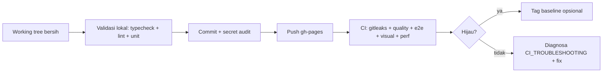

# Release Process

> **Date:** 2026-08-06 · **Author:** Release management (Sprint 0.7)
> **Scope:** branch strategy · commit hygiene · CI gate · tag · GitHub Pages deploy
> **Goal:** Rilis reproducible, aman, dan terdokumentasi

---

## 1. Branch Strategy

| Branch | Peran | Deploy |
|---|---|---|
| `gh-pages` | branch aktif utama (deploy + dev) | ✅ GitHub Pages (via workflow built-in + `.nojekyll`) |
| `main` | arsip/alias (opsional) | — |

Workflow CI berjalan pada push/PR ke `gh-pages` & `main`. Pages built-in workflow mendeploy SPA dari branch ini; `.nojekyll` menonaktifkan Jekyll (fix Liquid crash pada docs markdown — lihat [ACTIONS_MIGRATION_REPORT.md](ACTIONS_MIGRATION_REPORT.md) §6).

## 2. Commit Hygiene (wajib tim)

1. **Satu concern per commit** — fitur, test, docs, infra dipisah (contoh riil: `60ab972` fix seed terpisah dari `c1f2054` baseline perf).
2. **Secret audit sebelum commit** — pola standar proyek (di jalankan di tiap commit sesi):
   ```bash
   git diff --cached --name-only | grep -iE '\.env$|service-account|\.pem$|\.key$|\.db$|backups'
   git diff --cached | grep '^+' | grep -cE 'AIza[0-9A-Za-z_-]{20}|-----BEGIN|ghp_[A-Za-z0-9]{20}|TURSO_AUTH_TOKEN[ =][A-Za-z0-9]'
   ```
   Output **0** = bersih. Gitleaks di CI memindai full-history sebagai lapisan kedua.
3. **Pesan commit deskriptif** — apa + mengapa + bukti (angka test, referensi run CI).
4. **Jangan commit** `server/.env`, `.env.local`, `*.db`, logs, artefak investigasi (`src/debug/`, `scripts/tmp-*`).

## 3. Release Flow



1. **Pra-commit:** `npm run typecheck && npm run lint && npm run test:unit` hijau.
2. **Commit** dengan secret audit (tabel di atas).
3. **Push** ke `gh-pages` → CI berjalan (gitleaks + quality paralel, lalu e2e → visual → perf serial).
4. **Verifikasi CI hijau** — polling run: `gitleaks ✅ quality ✅ e2e ✅ visual ✅ perf ✅` + Pages deploy ✅.
5. **Tag baseline** (produksi freeze):
   ```bash
   git tag -a <nama> -m '...'
   git push origin <nama>
   ```
   Contoh riil: `react-performance-stable` (Sprint 0.6 baseline, commit `c1f2054`).

## 4. Gate — Rilis DIBLOKIR bila

- Gitleaks menemukan secret baru (scan full-history).
- quality/e2e/visual/perf merah (kecuali flake tunggal yang lolos stability gate 3× dengan warning).
- Ada artefak investigasi di working tree (`src/debug/`, `scripts/tmp-*`, `console.log` debug).
- Seed step gagal konsisten (3×) — lihat [CI_TROUBLESHOOTING.md](CI_TROUBLESHOOTING.md).

## 5. Checklist Rilis

- [ ] Working tree bersih (`git status --short` kosong kecuali file yang disengaja).
- [ ] Secret audit 0.
- [ ] Unit 471 hijau · typecheck · lint.
- [ ] CI run hijau penuh (5 job + Pages).
- [ ] Docs tersinkron (README/architecture/ADR bila fitur berubah).
- [ ] Tag baseline bila ini milestone (contoh: `v0.9.5`, `react-performance-stable`).
