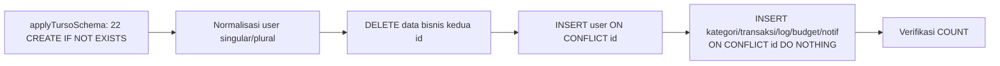

# Seed Database Guide

> **Date:** 2026-08-06 · **Author:** DevOps audit (Sprint 0.7 — CI stabilization)
> **Scope:** `scripts/seedE2eDataset.mjs`, `scripts/applyTursoSchema.mjs`, workflow steps
> **Goal:** Seed 100% deterministic & tahan error transient — akar flake CI yang sudah ditutup

---

## 1. Purpose

CI TIDAK bergantung pada DB development. Workflow men-seed DB Turso (secret) dengan **dataset deterministik** yang cocok dengan `PINNED` di `e2e/helpers/fixtures.ts`:

| Dataset | Nilai | Di-override CI via |
|---|---|---|
| transaksi | 284 (86 income / 131 expense / 67 transfer-refund) | `E2E_PINNED_TRANSACTIONS_TOTAL` dkk. |
| gmail_sync_logs | 519 (350 accepted / 30 needs_review / 139 skip-reject) | `E2E_PINNED_GMAIL_LOGS_TOTAL` |
| gmail_sync_runs | 2 | — |
| budgets / notifications | 5 / 3 | — |

RNG deterministik (`mulberry32(20260802)`) → dataset IDENTIK di tiap run.

## 2. Safety Guard

```bash
SEED_E2E=1 node scripts/seedE2eDataset.mjs
```

- Tanpa `SEED_E2E=1` script **menolak jalan** (exit 1) — mencegah penghapusan tidak sengaja data dev.
- Hanya menyentuh data milik **user seed** (email `ADMIN_EMAILS[0]` atau default `e2e-seed-admin@cashflow.test`) — delete-then-insert idempoten, data user lain aman.
- **Catatan resolusi email:** konstanta `ADMIN_EMAIL` dievaluasi saat module load, SEBELUM `loadEnv()` — jadi `server/.env` TIDAK pernah mengubah target seed; env shell menang (CI men-set `ADMIN_EMAILS` eksplisit). Lokal selalu jatuh ke default `e2e-seed-admin@…` → data admin dev (`qoidrifat23@gmail.com`) tidak pernah tersentuh.

## 3. Flow (idempoten)



1. **`applyTursoSchema.mjs`** — DB CI baru kosong → apply `turso-schema.sql` (idempoten, non-destruktif) + verifikasi 6 tabel inti ada.
2. **Normalisasi user singular/plural** — `user` (Better Auth) & `users` (bisnis) harus satu id. Desync id lama → DELETE baris desync + data bisnis kedua id, re-insert satu id konsisten. (Fix commit `60ab972` — menutup `UNIQUE constraint failed: users.email` di CI.)
3. **Delete-then-insert** — semua baris seed user dibersihkan lalu di-insert ulang → aman dijalankan berulang.

## 4. Stabilitas CI (Sprint 0.7) — root cause flake

**Masalah (evidence):** versi lama menjalankan ±870 INSERT sekuensial via `execute()` — **1 request HTTP per baris**:
- Seed lokal butuh **100 detik** (koneksi sehat), di CI shared runner lebih lama lagi (2–4 menit).
- SATU error transient (network/TLS/429 Turso) langsung mematikan job — **tanpa retry**.
- Terbukti: flake CI di step "Seed E2E dataset" (exit 1, artifacts kosong = suite tak pernah jalan) di commit `60ab972` & `c1f2054` — 4/5 run hijau, 1 gagal → pola transient.

**Fix (minimal, tanpa ubah schema/data):**

1. **Batching — `client.batch()`** chunk 100 (mode write transaction, atomic):
   - ±870 round-trip → **10 batch**.
   - Seed lokal: **100s → 4.3s (~23× lebih cepat)**; jendela error transient mengecil drastis.
2. **Retry exponential backoff** (4 attempt, base 400ms × 2ⁿ):
   - HANYA error transient (`network|timeout|econn|socket|429|5xx|fetch failed`).
   - Error **constraint TIDAK di-retry** (bug deterministik → gagal cepat & diagnosable, tidak di-masking).
3. **`ON CONFLICT(id) DO NOTHING`** defensif di semua INSERT deterministik.
   - ⚠️ `categories` pakai composite PK `(user_id, id)` → `ON CONFLICT(user_id, id) DO NOTHING` (bukan `(id)`).
4. **Timeout eksplisit per request** — custom fetch `AbortSignal.timeout` di `createClient({ fetch })` (juga di `applyTursoSchema.mjs`):
   - Default **30s**, override via env `SEED_TURSO_TIMEOUT_MS`.
   - Mengapa: tanpa timeout, request Turso yang HANG (network blackhole / TLS stall) menggantung **tanpa batas** sampai timeout job GitHub — jauh lebih buruk daripada error transien yang bisa di-retry.
   - Timeout menghasilkan DOMException `TimeoutError` (pesan mengandung `timeout`) → otomatis masuk jalur retry, attempt tidak terbuang.
   - Hanya berlaku untuk URL `http(s)`; DB `file:` lokal tidak terpengaruh.
5. **Error context** — setiap fase berlabel; failure melaporkan fase aktif terakhir + pesan penuh.

**Verifikasi lokal (2026-08-06):** seed RC=0, dataset identik (284/519/2/5/3), idempoten run ke-2 (3.8s), E2E subset 9/9 PASSED.

## 5. Usage

```bash
# CI (workflow) — urutan wajib:
node scripts/applyTursoSchema.mjs
SEED_E2E=1 node scripts/seedE2eDataset.mjs

# Lokal (DB sama dengan server/.env):
SEED_E2E=1 node scripts/seedE2eDataset.mjs

# Re-seed antar attempt stability gate (otomatis di e2e-stability-gate.sh):
SEED_E2E=1 node scripts/seedE2eDataset.mjs
```

## 6. Anti-pattern

| ❌ | ✅ |
|---|---|
| Insert per-baris `execute()` untuk dataset besar | `client.batch()` chunk 100 |
| Retry semua error | Retry hanya transient; constraint gagal cepat |
| Tanpa timeout (request hang → job GitHub timeout) | Custom fetch `AbortSignal.timeout` (30s, `SEED_TURSO_TIMEOUT_MS`) |
| `ON CONFLICT(id)` untuk tabel PK composite | `ON CONFLICT(<kolom PK sebenarnya>)` |
| Menghapus data user non-seed | Delete hanya `staleIds` (user seed) |
| Mengubah schema | `applyTursoSchema` non-destruktif, `IF NOT EXISTS` |
