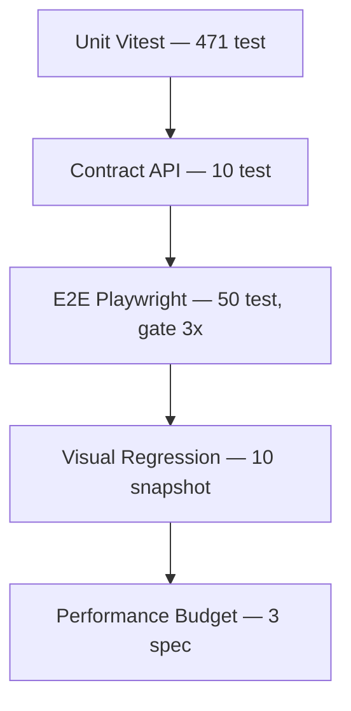

# Testing Strategy

> **Date:** 2026-08-06 · **Author:** QA audit (Sprint 0.7)
> **Scope:** unit · contract · e2e · visual · performance + gate order CI
> **Goal:** Regresi terdeteksi paling murah, paling cepat, paling dekat ke akar

---

## 1. Pyramid



| Lapisan | Jumlah | Biaya | Cakupan | Menangkap |
|---|---|---|---|---|
| Unit (Vitest) | 471 | detik | pure logic: parser, engine, validasi, guard | bug logika paling murah |
| Contract | 10 | ~1 menit | kontrak API vs schema | schema drift, response shape |
| E2E (Playwright) | 50 | ~10 menit | UI + API end-to-end + DB | regresi fitur lintas layer |
| Visual | 10 | ~4 menit | render dark/light, desktop/mobile | pixel regression |
| Performance | 3 | ~5 menit | budget page load / API p95 / pagination | regresi orde-magnitudo |

## 2. Gate Order (e2e.yml)

```
quality ──► e2e ──► visual ──► performance
   └──► gitleaks (paralel)
```

- `quality` adalah **gate pertama**: lint, `tsc` src, typecheck e2e, **unit test (vitest)**, build. Unit di quality = regresi unit memblokir merge SEBELUM e2e mahal berjalan (gap ditutup audit Phase-1: 8 unit test gagal tak terdeteksi sebelumnya).
- Job DB-heavy serial (aturan proyek — DB Turso bersama).
- **Stability gate 3×** di e2e & performance (`scripts/e2e-stability-gate.sh`): suite dijalankan hingga 3×; gagal HANYA bila 3× gagal berturut (regresi riil). Flake sesekali = hijau + warning + arsip per-attempt.
- Playwright `retries: 1` menangani flake per-test dalam satu run.

## 3. Commands

```bash
npm run lint                      # eslint + tsc src
npm run typecheck                 # tsc --noEmit (frontend)
npm run test:e2e:typecheck        # tsc e2e
npm run test:unit                 # vitest (471)
npm run build                     # produksi build
npm run test:e2e                  # playwright (54, exclude @visual|@perf)
npm run test:e2e:stability        # stability gate 3×
npm run test:e2e:contract         # contract 10
npm run test:e2e:visual:check     # snapshot check
npm run test:e2e:perf             # performance budget
```

## 4. Data Strategy

- **Unit/contract:** pure logic, tanpa DB nyata (mock/libsql in-memory bila perlu).
- **E2E/visual/perf:** DB Turso bersama + **seed deterministik** (`scripts/seedE2eDataset.mjs`) + `PINNED` fixtures yang di-override CI (`E2E_PINNED_*`). Lihat [SEED_DATABASE_GUIDE.md](SEED_DATABASE_GUIDE.md).
- **Isolasi test:** `workers: 1` (session DB bersama), cleanup sesi per test via `mintSession` helper — test tidak boleh bergantung pada urutan eksekusi.

## 5. Aturan Tulis Test

1. **Web-first assertions** — `expect(locator).toBeVisible()`, `expect.poll(...)` untuk state async (pagination/filter), `locator.waitFor()`. **Hindari `waitForTimeout`** — pengecualian yang diizinkan: *negative-state verification* (menunggu jendela settle untuk meng-assert bahwa bug TIDAK mendarat, lihat `gmail-review-amount-missing.spec.ts`) dan stabilisasi font visual.
2. **Deterministik** — tanpa clock/UUID/random tanpa kontrol; pakai data seed PINNED.
3. **Satu concern per test** — jangan gabung assert multi-fituran dalam satu `it`.
4. **Selector stabil** — prioritaskan role/aria; hindari selector berbasis struktur DOM yang rapuh.
5. **Regression guard** — pola yang mudah rusak diberi test statis (contoh: `storeSubscriptionGuard.test.ts` untuk larangan full subscription Zustand).

## 6. Debt

- E2E memakai DB bersama (bukan per-test DB) — keputusan arsitektural untuk cost; dikompensasi seed deterministik + serialisasi.
- Coverage AI/OCR di e2e masih terbatas (butuh mock/CI-only) — roadmap Sprint 2+.
