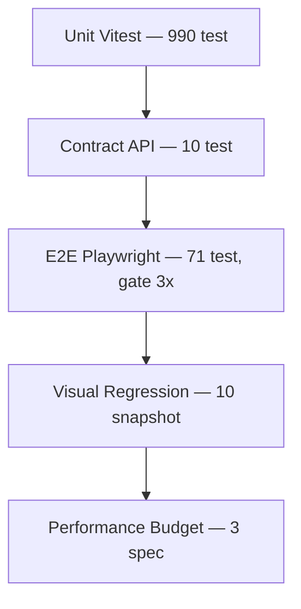

# Testing Strategy

> **Date:** 2026-08-06 (diperbarui 2026-08-09 — §7 rate limiting P1-2) · **Author:** QA audit (Sprint 0.7)
> **Scope:** unit · contract · e2e · visual · performance + gate order CI
> **Goal:** Regresi terdeteksi paling murah, paling cepat, paling dekat ke akar

---

## 1. Pyramid



| Lapisan | Jumlah | Biaya | Cakupan | Menangkap |
|---|---|---|---|---|
| Unit (Vitest) | 990 | detik | pure logic: parser, engine, validasi, guard + komponen React (RTL) | bug logika paling murah |
| Contract | 10 | ~1 menit | kontrak API vs schema | schema drift, response shape |
| E2E (Playwright) | 71 | ~10 menit | UI + API end-to-end + DB | regresi fitur lintas layer |
| Visual | 10 | ~4 menit | render dark/light, desktop/mobile | pixel regression |
| Performance | 3 | ~5 menit | budget page load / API p95 / pagination | regresi orde-magnitudo |

## 2. Gate Order (e2e.yml)

```
quality ──► e2e ──► visual ──► performance
   └──► gitleaks (paralel)
```

- `quality` adalah **gate pertama**: lint, `tsc` src, typecheck e2e, **unit test (vitest)**, build. Unit di quality = regresi unit memblokir merge SEBELUM e2e mahal berjalan (gap ditutup audit Phase-1: 8 unit test gagal tak terdeteksi sebelumnya).
- Job DB-heavy serial (aturan proyek — DB Turso bersama).
- **Stability gate 3×** di e2e & performance (`scripts/e2e-stability-gate.sh`): suite dijalankan hingga 3×; gagal HANYA bila 3× gagal berturut (regresi riil). Flake sesekali = hijau + warning + arsip per-attempt.
- Playwright `retries: 1` menangani flake per-test dalam satu run.

## 3. Commands

```bash
npm run lint                      # eslint + tsc src
npm run typecheck                 # tsc --noEmit (frontend)
npm run test:e2e:typecheck        # tsc e2e
npm run test:unit                 # vitest (990) — dua project: unit-node + unit-dom
npx vitest run --project unit-node # pure logic saja (environment node — tanpa DOM boot)
npx vitest run --project unit-dom  # komponen React saja (environment happy-dom, RTL)
npm run build                     # produksi build
npm run test:e2e                  # playwright (54, exclude @visual|@perf)
npm run test:e2e:stability        # stability gate 3×
npm run test:e2e:contract         # contract 10
npm run test:e2e:visual:check     # snapshot check
npm run test:e2e:perf             # performance budget
```

## 4. Vitest Projects (2026-08-09)

`vitest.config.ts` memakai dua project terpisah (vitest 3 `projects`):

| Project | Environment | Isi |
|---|---|---|
| `unit-node` | `node` | `tests/unit/**/*.test.ts` (pure logic) + `tests/benchmark/**/*.spec.ts` (benchmark offline) |
| `unit-dom` | `happy-dom` | `tests/unit/**/*.test.tsx` (komponen React: statCard, aiShownTelemetryDedup, aiFeedbackButtons) |

- **Sebelumnya**: environment `node` global + docblock `// @vitest-environment jsdom` per file `.tsx` — setiap file komponen men-boot jsdom sendiri (tidak bisa di-share antar file → overhead).
- **Sekarang**: environment ditetapkan SEKALI di level project; `happy-dom` boot jauh lebih ringan daripada jsdom; docblock dihapus dari semua file komponen.
- Suite pure-logic (`unit-node`) berjalan TANPA overhead DOM boot — environment 21 ms vs sebelumnya 30 s agregat (DOM boot per file).
- Menjalankan: `npm run test:unit` (keduanya, pola lama tetap), atau `--project unit-node` / `--project unit-dom` untuk subset.

**Setup & helper bersama (2026-08-09):**

- `tests/unit/setup.ts` — `setupFiles` project `unit-dom`: jest-dom matchers + `afterEach(() => cleanup())` SEKALI untuk semua file `.tsx` (vitest `globals: false` → RTL tidak bisa auto-register cleanup; dulu di-duplikasi per file).
- `tests/unit/helpers/render.tsx` — helper render bersama (saat ini `renderCard` + `valueElement` dari statCard.test.tsx); komponen test berikutnya cukup `import { renderCard } from './helpers/render'` tanpa boilerplate RTL/jest-dom/afterEach.
- File test komponen tetap bebas menambahkan mock sendiri (pola aiShownTelemetryDedup) — helper hanya untuk render + setup.

## 5. Data Strategy

- **Unit/contract:** pure logic, tanpa DB nyata (mock/libsql in-memory bila perlu).
- **E2E/visual/perf:** DB Turso bersama + **seed deterministik** (`scripts/seedE2eDataset.mjs`) + `PINNED` fixtures yang di-override CI (`E2E_PINNED_*`). Lihat [SEED_DATABASE_GUIDE.md](SEED_DATABASE_GUIDE.md).
- **Isolasi test:** `workers: 1` (session DB bersama), cleanup sesi per test via `mintSession` helper — test tidak boleh bergantung pada urutan eksekusi.

## 6. Aturan Tulis Test

1. **Web-first assertions** — `expect(locator).toBeVisible()`, `expect.poll(...)` untuk state async (pagination/filter), `locator.waitFor()`. **Hindari `waitForTimeout`** — pengecualian yang diizinkan: *negative-state verification* (menunggu jendela settle untuk meng-assert bahwa bug TIDAK mendarat, lihat `gmail-review-amount-missing.spec.ts`) dan stabilisasi font visual.
2. **Deterministik** — tanpa clock/UUID/random tanpa kontrol; pakai data seed PINNED.
3. **Satu concern per test** — jangan gabung assert multi-fituran dalam satu `it`.
4. **Selector stabil** — prioritaskan role/aria; hindari selector berbasis struktur DOM yang rapuh.
5. **Regression guard** — pola yang mudah rusak diberi test statis (contoh: `storeSubscriptionGuard.test.ts` untuk larangan full subscription Zustand).

## 7. Debt

- E2E memakai DB bersama (bukan per-test DB) — keputusan arsitektural untuk cost; dikompensasi seed deterministik + serialisasi.
- Coverage AI/OCR di e2e masih terbatas (butuh mock/CI-only) — roadmap Sprint 2+.

## 8. Rate Limiting — Keputusan Audit P1-2

> Keputusan arsitektur (2026-08-09): **`express-rate-limit` = SATU-SATUNYA source of truth** untuk rate limiting. Dokumen lengkap: [RATE_LIMITING.md](../security/RATE_LIMITING.md) (alasan, middleware order, format 429, catatan operasional) — bagian ini ringkasan audit untuk konteks testing/CI.

### 8.1 Dua lapis limiter yang pernah aktif bersamaan

Better Auth 1.6.25 punya rate limiter **bawaan dengan default `enabled: isProduction`** (100 req/10s/IP, storage memory) — bila dibiarkan, di produksi ia **menumpuk DI ATAS** express-rate-limit:

| | Limiter bawaan better-auth | express-rate-limit (CashFlow) |
|---|---|---|
| Lokasi | `server/lib/auth.js` `rateLimit` | `server/index.js` (4 limiter) |
| Default di produksi | **AKTIF** (`enabled: isProduction`) | aktif (`RATE_LIMIT_ENABLED !== 'false'`) |
| Window / limit | 10 s / 100 req **per-IP** | 15 mnt; per-user setelah auth (`u:<id>`) |
| Storage | **memory** (counter per-IP tanpa eviction tegas) | express-rate-limit (draft-7 headers) |
| Format 429 | `{"message":"Too many requests…"}` + header `X-Retry-After` | `{ ok:false, code:'RATE_LIMITED', message }` + `Retry-After` + `ratelimit` (draft-7) |
| Status | **DI-DISABLE eksplisit** | single source of truth ✅ |

### 8.2 Alasan disable limiter bawaan

1. **Dua kontrak 429 berbeda** — frontend (`src/config/api.ts`) dan seluruh E2E contract mengandalkan format express-rate-limit; 429 bawaan better-auth tidak dikenali → UX/error handling salah cabang.
2. **Budget ganda & keying berbeda** — per-IP 10 s vs per-user 15 mnt: IP bisa diblokir saat user masih punya budget (sulit di-debug, "double punishment").
3. **Storage memory tanpa batas** — counter per-IP di memori proses bisa tumbuh di produksi beban tinggi.
4. Satu limiter = satu kontrak = satu keying = satu tempat debugging.

**Implementasi:** `rateLimit: { enabled: false }` di `server/lib/auth.js`, di-lock `tests/unit/authConfig.test.ts` + `authRateLimitConfig.test.ts`, dan **dibuktikan live di produksi** oleh `npm run verify:auth-prod` (`scripts/verify-auth-prod-limiter.mjs` — burst 120× get-session tanpa 429/header bawaan, 429 express kanonik tetap jalan, origin check 403, HSTS + Secure cookie).

### 8.3 Env override express-rate-limit (`server/index.js`)

| Env | Default | Arti |
|---|---|---|
| `RATE_LIMIT_ENABLED` | aktif (`!== 'false'`) | `false` → semua limiter jadi no-op (dev/CI only — **jangan di produksi**) |
| `RATE_LIMIT_GENERAL_MAX` | `5000` | umum / 15 mnt (semua route setelah auth; skip `/api/health` + `/api/ready`) |
| `RATE_LIMIT_AUTH_MAX` | `120` | POST `/api/auth/*` / 15 mnt (**GET skip** — session-read dipanggil SPA tiap page-load; + skip `/api/health`) |
| `RATE_LIMIT_AI_MAX` | `120` | `/api/gemini` + `/api/agent-search` / 15 mnt |
| `RATE_LIMIT_RECEIPT_MAX` | `30` | `/api/ai/extract-receipt-image` / 15 mnt |

Semua: `windowMs` 15 mnt (tidak di-env-kan), `standardHeaders: 'draft-7'`, `legacyHeaders: false`, message `{ ok:false, code:'RATE_LIMITED' }`, key per-user setelah auth (`u:<userId>`) / per-IP sebelum auth.

### 8.4 Regression guards (keluarga limiter)

| Guard | Cakupan |
|---|---|
| `e2e/rate-limit.spec.ts` (server 5182, `AUTH_MAX=25`) | authLimiter POST `/api/auth/*` → 429 ≤ 26 request · body `RATE_LIMITED` · draft-7 headers · GET session tetap 200 |
| `e2e/rate-limit-ai-general.spec.ts` (server 5182, `AI_MAX=8`, `GENERAL_MAX=20`, `RECEIPT_MAX=8`) | aiLimiter POST `/api/gemini/*` + generalLimiter GET `/api/transactions` + **receiptLimiter POST `/api/ai/extract-receipt-image`** (message membedakan limiter; body `{}` → 400 MISSING_IMAGE tetap dihitung limiter) · `/api/health` tetap 200 |
| `scripts/verify-auth-prod-limiter.mjs` (`npm run verify:auth-prod`) | **live produksi** — lihat §7.2 |

Jalankan keluarga: `npm run test:e2e:ratelimit` — **seluruh keluarga limiter (auth + AI + general + receipt) kini punya regression guard E2E** (2026-08-09, receiptLimiter ditutup; 4 passed).

---

## 9. P1 Testing Improvements (2026-08-09)

Milestone P1: dari "suite yang berjalan" → **reliable quality system** (determinisme, isolasi, AI mocking, a11y, visual regression). Seluruh perubahan backward-compatible — tidak ada behavior produk yang diubah.

### 9.1 Component Testing (P1.1–P1.6)

| Component | File test | Cakupan |
|---|---|---|
| TransactionItem | `tests/unit/transactionItem.test.tsx` | tanda ± expense/income, source label, fraud flag, category, field null |
| ErrorState | `tests/unit/errorState.test.tsx` | title/message, retry callback, loading tidak double-action |
| EmptyState | `tests/unit/emptyState.test.tsx` | title/description, CTA + callback |
| AiTrustMeta | `tests/unit/aiTrustMeta.test.tsx` | metadata lengkap/parsial, confidence invalid, long text, **evidence bukan raw HTML** |
| AiConfidenceBadge | `tests/unit/aiConfidenceBadge.test.tsx` | boundary threshold label |
| CategoryIcon | `tests/unit/categoryIcon.test.tsx` | category dikenal/tak dikenal/missing → fallback, tidak crash |
| timelineGroup (pure) | `tests/unit/timelineGroup.test.ts` | group key Hari Ini/Kemarin/Minggu Ini/Sebelumnya (TZ-independen) |
| budgetStatus (pure) | `tests/unit/budgetStatus.test.ts` | boundary 0/50/100/>100% |
| BudgetCard | `tests/unit/budgetCard.test.tsx` | status warning/overbudget, progress bar, motion mock |

Filosofi: **behavior user-visible** (getByRole/getByText), bukan implementation detail. Infra: `tests/unit/helpers/render.tsx` + setup jest-dom; project vitest `unit-dom` (happy-dom) terpisah dari `unit-node` (node) supaya suite pure-logic tidak menanggung boot DOM per file. Total komponen+pure: **+94 test** (suite unit 1021 → 1115 passed). Bug ditemukan saat menulis test: `AiTrustMeta` merender `"Sumber: "` kosong saat metadata `{}` — diperbaiki (fallback "—").

### 9.2 E2E DB Isolation (P1.7)

Sebelumnya: suite lokal berbagi DB Turso **development** (data drift antar run = sumber flake PINNED). Kini ada **dua konfigurasi**:

| | `playwright.config.ts` (main) | `playwright.e2e-local.config.mjs` (isolated) |
|---|---|---|
| DB | Turso dev (lokal) / CI seed (CI) | **libSQL file lokal fresh per run** (`.test-data/e2e-local.db`) |
| Port | 5180/5181 (+5182 rate-limit, 5183/5184 webhook) | 5190/5191 |
| Suite | penuh (incl. rate-limit/webhook/perf) | fungsional: **grepInvert @visual\|@perf** + ignore rate-limit & notification-metadata-guard (butuh server khusus yang ada di main) |
| Command | `npm run test:e2e` | `npm run test:e2e:isolated` |

Lifecycle (config webServer chain): `scripts/prepare-e2e-local-db.mjs` → hapus DB lama (self-heal) → `initTursoSchema` + `applyMigrations` (versioned, pola produksi) → seed deterministik CI (284 tx / 519 logs — PINNED sama dengan CI) → **demo fixtures Dafa** (user demo@cashflow.test + ai_timeline `demo-tl-*` dari `scripts/seedDemoData.mjs` — dipakai spec ai-detail-events/ai-status-machine) → verifikasi count → boot API (GEMINI_MOCK=1, RATE_LIMIT_ENABLED=false) + Vite.

**Guard keamanan**: `assertE2eDbSafe` di `e2e/helpers/mintSession.ts` (fail-fast `E2E_DB_DENY_URLS`); `prepare-e2e-local-db.mjs` **menolak URL non-`file:`** — E2E tidak pernah menulis DB remote dari jalur ini.

**Bug nyata yang ditemukan & diperbaiki selama implementasi** (produk, bukan test):
1. `server/routes/transactionRoutes.js` — INSERT transactions **19 placeholder untuk 18 kolom** (regresi penambahan `idempotency_key`): SETIAP POST /api/transactions 500 `19 values for 18 columns`. Terdeteksi hanya karena E2E isolated menembak jalur SQL nyata (unit test mem-mock execute). Fix: placeholder disamakan; **guard drift** `assertInsertShape` ditambahkan di `tests/unit/transactionIdempotency.test.ts` (kolom == placeholder == args).
2. **SQLITE_BUSY** writer-vs-writer pada DB file lokal (server API + helper test = dua proses). Fix: `PRAGMA busy_timeout = 10000` untuk `file:` URL di **kedua sisi** — `server/lib/turso.js` (getTurso) dan factory bersama `createE2eTursoClient` (mintSession, kini diekspor & dipakai 7 spec yang sebelumnya membuat client sendiri). Remote Turso tidak terpengaruh (pragma hanya untuk `file:`).

Hasil: **2× run beruntun 88/88 hijau** (0 flaky) — sebelumnya 12–18 failure bergiliran antar run.

### 9.3 Gemini Mock Boundary (P1.8)

`server/lib/aiMock.js` — mock **hanya boundary provider** (Vertex/Gemini adapter di `server/lib/vertexContext.js`), bukan business logic:

- `GEMINI_MOCK=1` → respons deterministik (conversation ringkasan + fallback, OCR/insight structured) — offline, tanpa kredensial, tanpa quota.
- Tanpa env → perilaku produksi penuh (tidak ada perubahan path produksi).
- **Fail-fast**: `assertGeminiMockSafe` di `server/index.js` — `GEMINI_MOCK=1` + `NODE_ENV=production` → boot ditolak (mock tidak boleh aktif di produksi).
- Skenario di-cover unit (`tests/unit/aiMock.test.ts`, 23 test): success, empty, malformed, timeout, 429, 500, OCR success/uncertain/failure, fallback rule-based tetap mengikuti schema output existing (tidak raw error / tidak hallucinate).

### 9.4 Accessibility (P1.9)

- Dep: `@axe-core/playwright` (dev).
- `e2e/accessibility.spec.ts`: scan axe 5 halaman inti — `/dashboard`, `/transactions`, `/ai`, `/ai/timeline`, `/admin/monitoring` — auth sesi nyata (mintSession; admin memakai ADMIN_EMAILS[0]), tanpa localStorage hack.
- **Gate: 0 violation CRITICAL** (serious tetap dicatat sebagai debt §9.7 — mayoritas kontras palette yang butuh design-system pass).
- Fix yang masuk produk: 8 tombol ikon tanpa accessible name diberi `aria-label` (Sidebar logout, Header, CategoriesPage, Modal close, ProfessionalSuitePage, TransactionsPage filter) → kelas axe `button-name` hilang.

### 9.5 Visual Regression (P1.10)

`e2e/visual/visual-regression.spec.ts` diperluas dari (landing, dashboard) → **16 snapshot**:

| Halaman | Theme | Masking |
|---|---|---|
| landing (desktop+mobile) | light+dark | — (statis) |
| dashboard | light+dark | stat cards (data) |
| transactions | light+dark | nominal `tabular-nums` + counter |
| gmail-sync | light+dark | summary values + email list (display:none) + badge |
| **reports** (baru) | light+dark | `p.tabular-nums` + `.recharts-wrapper` |
| **ai-timeline** (baru) | light+dark | event list **deterministik** (seed `e2e-visual-tl-*` user dedikasi, tanggal tetap → group "Sebelumnya" stabil) |
| **admin-monitoring** (baru) | light+dark | `.recharts-wrapper` + semua `tabular-nums`; metrics seed deterministik (`e2e-reco-*`, `e2e-fr-*`, `e2e-usage-*`, `e2e-ret-*`) |

Baseline di-commit (`snapshotPathTemplate` tanpa platform suffix — portabel lintas OS). Verify: `npm run test:e2e:visual:check` (16/16). Generate: `npm run test:e2e:visual` (--update-snapshots). Anti-flaky: fonts.ready, animasi disabled, caret hide, maxDiffPixelRatio 0.02.

### 9.6 Commands (P1.11)

```bash
npm test                  # canonical fast gate = test:unit
npm run typecheck         # tsc --noEmit
npm run lint              # tsc src
npm run test:unit         # vitest run (semua project)
npm run test:component    # vitest run --project unit-dom (komponen React)
npm run test:e2e          # Playwright (main config, grep-invert @visual|@perf)
npm run test:e2e:isolated # Playwright (DB lokal fresh, tanpa Turso — 1 worker)
npm run test:e2e:parallel # P2.2 — N worker paralel (per-worker DB file + port)
npm run test:a11y         # alias test:e2e:a11y (axe light+dark, gate serious=0)
npm run test:e2e:visual:check  # visual regression verify
npm run audit:deps        # P2.4 — tiered dependency audit gate
npm run build
```

CI (`e2e.yml`) menambah: **e2e-isolated** (tanpa secrets Turso — DB lokal,
GEMINI_MOCK; paralel setelah quality), **e2e-parallel** (P2.2 — shard 4 worker,
masing-masing DB file sendiri; paralel), dan **a11y** (P2.1 — serial setelah
E2E, DB CI seed, gate serious=0). Dependency audit = **tiered gate** (P2.4,
step di job quality) — CRITICAL/HIGH-production blocking, exception hanya via
registri review-date; TIDAK ada `npm audit fix --force` di CI.

### 9.7 Remaining Debt (jujur, bukan klaim selesai)

Status P1 → P2 (semua debt P1 berikut RESOLVED di P2 — lihat §10):

1. ~~Kontras serius di 5 halaman~~ → **RESOLVED P2.1**: serious color-contrast = 0 (light+dark), design-token + opacity scale fix.
2. Harness idempotency/unit mem-mock `execute` — SQL route tidak divalidasi terhadap schema riil di unit; **integration coverage** jalur SQL nyata ada di E2E isolated (dan guard `assertInsertShape` menutup kelas bug placeholder-count).
3. ~~Per-worker DB (worker 0 → DB 0, dst.)~~ → **RESOLVED P2.2**: shard-based per-worker isolation (satu worker per process; Playwright webServer tidak mendukung server per-worker — constraint didokumentasikan, lihat §10.2).
4. Visual snapshot baru (reports/ai-timeline/admin) perlu diamati 1–2 run CI untuk memastikan nol drift antar OS.

## 10. P2 Production Quality (2026-08-09)

### 10.1 Design-System Contrast Pass (P2.1)

- Akar masalah: token semantic `text-app-subtle` di atas `bg-app-hover`, pill `text-primary-500` di `bg-primary-50`, badge `text-primary-600` 10px, dan — temuan nyata — **opacity `/12` (dan 8/15/24/28) tidak pernah di-generate Tailwind JIT** (di luar skala default) → `dark:bg-*-500/12` senyap hilang → pill/badge dark memakai bg LIGHT (kontras 1.78:1).
- Fix design-system: tambah opacity 8/12/15/24/28 ke skala Tailwind (satu tempat, ~120 pemakaian), naikkan token text-app-subtle, pill/badge ke shade kontras-aman.
- Axe: `e2e/accessibility.spec.ts` scan **5 halaman × light+dark** (10 kombinasi), animasi framer-motion ditunggu selesai secara KONDISIONAL (poll inline opacity — bukan sleep), gate = **0 serious/critical**. Non-blocking (moderate/minor) dicatat sebagai tren.
- Hasil: 10/10 hijau · serious color-contrast = 0 · visual regression 16/16 (1 baseline di-update: transactions-dark — tint dark kini benar-benar render).

### 10.2 Per-Worker E2E DB Isolation (P2.2)

- Constraint: Playwright `webServer` berjalan SEKALI per process test — tidak ada server per-worker. Solusi deterministik: **per-process (shard) isolation** — satu worker per process, masing-masing dengan DB file sendiri + port sendiri + slice test sendiri.
- `E2E_SHARD_INDEX=i` → `.test-data/e2e-shard-<i>.db` · Vite `5190+2i` · API `5191+2i` · baseURL per worker. `scripts/run-e2e-shards.mjs` meluncurkan N process shard konkuren (default 2 lokal, 4 di CI).
- Bukti isolasi: `e2e/worker-isolation.spec.ts` — DB file worker sendiri (guard file:), seed PINNED utuh, marker user-scoped + marker TIDAK bocor ke DB file worker tetangga (dibaca read-only), port tetangga tidak menjawab sebagai milik worker ini.
- Benchmark (i5-1135G7, 8-thread, RAM 4GB free):

| Konfigurasi | Wall time | Hasil | Catatan |
|---|---|---|---|
| 1 shard (P1) | ~3.7–4.6 mnt | 94/94 | baseline P1 |
| 2 shard | 3 mnt 18 dtk | 94/94 | rekomendasi dev |
| 4 shard | 3 mnt 05 dtk | 94/94 | jenuh CPU/RAM (per-test ~2× melambat) |

- Target <1.5 mnt **belum tercapai di hardware ini** (CPU-bound) — constraint lingkungan, bukan arsitektur; di CI runner lebih besar (E2E_SHARDS=4) mendekati target. Stabilitas > kecepatan (P2 §34C): 2 shard dipilih sebagai default dev.

### 10.3 Component Test Expansion (P2.3 → final P2.3.1)

Halaman penuh (mock boundary service/store/router/animasi, business logic nyata).
**Final P2.3.1: 17 file komponen · 168 test** (target P2.3 ≥ 30 meaningful —
terlampaui 5×; tidak ada test palsu — semuanya mengunci kontrak behavior):

| Komponen | File | Test | Cakupan kunci |
|---|---|---|---|
| AiHubPage | `aiHubPage.test.tsx` | 6 | loading/empty/populated, error degrade, telemetry exposure |
| MonitoringPage | `monitoringPage.test.tsx` | 6 | loading/populated/empty, 403 tanpa retry, 500+retry, partial panel |
| BudgetsPage | `budgetsPage.test.tsx` | 10 | loading/empty/error, warning/overbudget boundary, CRUD |
| AiTimelinePage | `aiTimelinePage.test.tsx` | 11 | list/filter/detail/status/feedback |
| ReportsPage | `reportsPage.test.tsx` | 8 | ringkasan/chart/empty/error |
| DashboardPage | `dashboardPage.test.tsx` | 7 | loading/error/populated/chart a11y/overbudget/fraud |
| TransactionItem | `transactionItem.test.tsx` | 14 | tanda ±/source/fraud/null |
| AiTrustMeta | `aiTrustMeta.test.tsx` | 11 | metadata lengkap/parsial/invalid/long |
| AiConfidenceBadge | `aiConfidenceBadge.test.tsx` | 11 | threshold label boundary |
| AiFeedbackButtons | `aiFeedbackButtons.test.tsx` | 16 | rating/reason/submit/batal |
| StatCard | `statCard.test.tsx` | 21 | format besar/0/null/tanda |
| BudgetCard | `budgetCard.test.tsx` | 11 | progress/warning/overbudget |
| CategoryIcon | `categoryIcon.test.tsx` | 10 | dikenal/tak dikenal/fallback |
| ErrorState | `errorState.test.tsx` | 9 | title/message/retry/loading |
| EmptyState | `emptyState.test.tsx` | 7 | title/CTA/callback |
| aiShownTelemetryDedup | `aiShownTelemetryDedup.test.tsx` | 8 | StrictMode double-mount sekali |
| motionConfigReducedMotion | `motionConfigReducedMotion.test.tsx` | 2 | `reducedMotion="user"` wiring |

### 10.4 Tiered Dependency Audit (P2.4)

- `scripts/dependencyAudit.mjs` + `scripts/dependency-audit.exceptions.json`; kebijakan & registri: `docs/security/DEPENDENCY_AUDIT.md`.
- Targeted patch upgrades (tanpa force): postcss 8.5.26, react-router-dom 7.18.2, concurrently 10.0.4 → temuan 9 → 3 (0 blocking).
- CI: step `Dependency audit (tiered gate)` di job quality, fail-fast setelah install.

## 11. P2.2 Accessibility & UI Hardening (2026-08-09)

### 11.1 a11y spec — cakupan diperluas

`e2e/accessibility.spec.ts`: 5 → **7 halaman** × light+dark = 14 scan axe
(serious/critical = 0) + **4 test targeted**:

| Test | Assertion |
|---|---|
| ai-search focus ring | input fokus → box-shadow non-none (focus-within ring di label) |
| charts accessible name | dashboard + reports `role="img"` + aria-label bermakna |
| admin heading hierarchy | urutan level h1→h2 tanpa lompat >1 |
| reduced motion smoke | `emulateMedia({reducedMotion:'reduce'})` → app tetap berfungsi |

### 11.2 Unit: MotionConfig wiring

`tests/unit/motionConfigReducedMotion.test.tsx` (2 test): `reducedMotion="user"`
teruskan ke MotionConfigContext; default tanpa prop = `"never"` (dokumentasi
akar masalah P2.1 — CSS reduce tidak meng-gate framer rAF).

### 11.3 Visual determinism — temuan & fix

- **Reports flake**: AI Monthly Report card (POST `/api/gemini/monthly-report`,
async, bisa fallback local) → tinggi card bervariasi → chart bergeser → mask
`.recharts-wrapper` (#F0F Playwright) di posisi beda → baseline mismatch.
  Fix: mock route payload FIXED + tunggu loading text hilang (pola sama mock
  `/api/gemini/health` di dashboard).
- **Route transition overlay**: `animations:'disabled'` tidak menahan framer rAF
  → overlay transisi tertangkap screenshot. Fix: poll inline opacity selesai
  sebelum snapshot (pola `waitForFadesToFinish` a11y spec).
- Baseline di-update intentional: `gmail-sync-light` (10→11px interaktif +
drift dataset P1), `reports-light/dark` (chip primary-600 + mock AI card).

### 11.4 Gate

```text
npm run test:a11y             # 22 passed (9 halaman × 2 tema + 4 targeted)
npm run test:e2e:visual:check # 16 passed (deterministik)
npm run test:unit             # 1188 passed
npm run build                 # PASS
```

## 12. P2.3 Quality Hardening (2026-08-10)

P2.3 = lanjutan P2.2 (dari "fix temuan" → verifikasi menyeluruh + penutup gap).

### 12.1 Component tests — final

17 file komponen · 168 test (lihat §10.3). Pola: `test:component`
(`vitest run --project unit-dom`). Semua deterministik, tanpa network/DB/Gemini.

### 12.2 Accessibility deep pass

- `e2e/accessibility.spec.ts`: **9 halaman × light+dark = 18 scan axe**
  (dashboard, transactions, ai-hub, ai-timeline, admin-monitoring, ai-search,
  reports, gmail-sync, privacy) + 4 test targeted (focus ring, chart name,
  heading hierarchy, reduced motion) — **22/22 PASS**, gate 0 serious/critical.
- `e2e/keyboard-nav.spec.ts` (P2.3.2 §6): tab-walk + reachability 4 halaman
  (dashboard, transactions, ai-timeline, admin-monitoring) — **4/4 PASS**.
- **Bug spec ditemukan & diperbaiki (root-caused, bukan asumsi):**
  1. *Keyboard false-positive "trap"*: guard lama membandingkan key
     `tag:name` — dashboard punya 3 tombol "Lihat" BERBEDA (fraud widget 3
     baris) → dikira stuck. Probe membuktikan fokus bergerak normal
     (`same=false` tiap langkah). Fix: guard trap berbasis **identitas
     elemen** (`handle.evaluate(el => el === document.activeElement)`) —
     nama sama antar elemen beda bukan pelanggaran.
  2. *A11y targeted chart flake*: `waitForLoadState('networkidle')` di
     /reports tidak pernah settle (pagination ribuan transaksi — pola yang
     sama sudah didokumentasikan P2.2). Fix: `domcontentloaded` + gate konten
     (`Net Cashflow` visible). Probe membuktikan 2 `role="img"` ada.

### 12.3 Typography tokenization (P2.3.3)

- Audit: `text-[9px]` = 0 · `text-[10px]` = 92 (semua meta non-interaktif) ·
  `text-[11px]` = 168 (interaktif/label/table — legal).
- Token semantic baru di `tailwind.config.js`: `text-meta` (10px, kategori C)
  & `text-label` (11px, kategori B); caption → `text-xs`, body → `text-sm`
  (default, tidak diduplikat). Aturan + klasifikasi A/B/C/D di
  `docs/ui/DESIGN_TOKENS_AND_CONTRAST.md` §6.3.
- `scripts/typography-lint.mjs` diperluas: `text-meta` pada elemen interaktif
  DITOLAK (analog `text-[10px]`) — token baru tidak menjadi celah guard.

### 12.4 Flake unit — root cause & fix

`authConfig.test.ts` & `authRateLimitConfig.test.ts` timeout 5s HANYA di full
suite (lulus isolasi). Root cause: `vi.mock(..., async (importOriginal))`
memuat **better-auth asli ~3MB** (server/node_modules) di tiap worker fork
paralel → contention import > 5s. Fix: mock factory **sinkron**
`() => ({ betterAuth: mock })` — auth.js hanya mengimpor named export tsb.
Deterministik, tidak ada beban memuat library besar. Unit: **1188 passed**.

### 12.5 Visual & performance

- Visual regression: **16/16 PASS × 2 run berturut-turut** (1.2m + 1.0m) —
  P2.3.8 stabil, tanpa baseline update (tidak ada perubahan desain di P2.3).
- Build PASS; chunk production: entry `index` 106 kB (gzip 33) · recharts
  ter-split `CartesianChart` 337 kB (gzip 101) · lazy halaman terverifikasi
  (Monitoring 39, AiHub 32, Reports 30, AiTimeline 15 kB). Guard
  `bundleEntryGuard.test.ts` memastikan recharts TIDAK pernah kembali ke
  entry chunk.

### 12.6 Dependency audit & CI

- `npm run audit:deps` PASS: 0 critical · 0 blocking high-production · vite
  HIGH di-exception terdokumentasi (dev-only, review 2026-09-09) · 2 moderate
  warning dev-only (esbuild, protobufjs — non-blocking, fix tersedia).
- `e2e.yml` sudah menjalankan seluruh gate P2.3.9: lint, typecheck,
  e2e:typecheck, unit (termasuk komponen), build, tiered audit, gitleaks,
  e2e isolated + paralel + a11y. Tidak ada perubahan CI yang diperlukan.
- Command hygiene (P2.3.10): `test`/`test:unit`/`test:component`/`test:e2e`/
  `test:a11y`/`test:visual`/`test:visual:check`/`build`/`lint`/`typecheck`
  — semua sudah ada & konsisten.

## 13. P0 Gmail Deduplication & Cleanup (2026-08-11)

Kontrak lengkap: `docs/gmail/GMAIL_DEDUPLICATION_CONTRACT.md`. Matriks test
untuk dedupe gmail (`satu pesan → satu transaksi canonical`):

| Area | File | Cakupan |
| ---- | ---- | ------- |
| Server dedupe | `tests/unit/transactionGmailDedupe.test.ts` (8) | Pesan lama → replay tanpa INSERT · pesan baru → INSERT · user isolation · source=gmail tanpa msgId → perilaku lama · source≠gmail dengan msgId → cek tidak aktif · idempotency short-circuit mendominasi · race TOCTOU (idempotency + gmail index) → replay, bukan 500 · auth gate |
| Unique index / migration | `tests/unit/migrationRunner.test.ts` (+ schemaContract) | Applied `0001-0003` · index unik + partial + definisi WHERE lengkap di kontrak · drift (hilang / non-unique) terdeteksi |
| Klien offline + cross-tab | `tests/unit/transactionServiceWindowless.test.ts` (44) | Fallback localStorage replay · registry per-key claim-and-verify · race simultan → satu pemenang · wait-loop → replay saat confirm tiba · user isolation registry · normalisasi `isAlreadyImportedLocal` (throw vs replay konsisten) |
| E2E API-level | `e2e/fraud-detection.spec.ts` | POST `/api/transactions` 2× dengan `gmail_message_id` SAMA → duplikat (satu canonical) |
| E2E UI review | `e2e/gmail-review-duplicate.spec.ts` | Approve email yang sudah ada → status `duplicate`, tanpa baris kedua |

Cleanup tooling (QA temp-DB terverifikasi 2026-08-11): guard eksekusi tanpa
env → exit 1 · dry-run breakdown by month/source · backup sebelum delete ·
keep-oldest · verify recount 0 · rerun idempoten · audit `admin_audit_log`
(dry_run/success/failure) · baris manual & multi-key TIDAK tersentuh.

Command: `npm run db:audit:gmail-duplicates` (dry-run read-only) ·
`npm run db:cleanup:gmail-duplicates` (butuh `--execute --yes` + env guard).

## 13b. Transfer internal = netral — `own_accounts` (2026-08-11)

Keputusan produk user (Skr A): transfer ke **akun milik sendiri** tidak
mengurangi saldo. Implementasi lengkap & verifikasi DB dev:
`docs/financial/FINANCIAL_CALCULATION_INTEGRITY.md` §10.13. Matriks test:

| Area | File | Cakupan |
| ---- | ---- | ------- |
| Formula + parse | `tests/unit/financialSummary.test.ts` (+ownAccounts) | `buildSummaryQuery` SQL dinamis `merchant NOT IN (...)` · args order (`accounts` mendahului `baseArgs`) · empty → konstanta legacy · `parseOwnAccounts` robust (non-string/korup → []) |
| Rekonsiliasi real DB | `tests/unit/financialSummaryReconciliation.test.ts` (+ownAccounts) | DB libsql file nyata: transfer ke own account netral (balance berubah eksak) · transfer pihak lain tetap expense · empty = legacy |
| Route settings | `tests/unit/financialSettingsRoute.test.ts` (baru) | GET/PUT `/api/financial/settings` · requireAuth · user-scoped · validasi fail-closed (bukan array / >100 akun / >191 char / non-string → 400 VALIDATION_ERROR) · upsert ON CONFLICT · user isolation |
| Route summary | `tests/unit/transactionSummaryRoute.test.ts` | Settings dibaca dari DB → `ownAccounts` diteruskan; tabel absent → legacy `[]` |
| Paritas client | `tests/unit/reportsPage.test.tsx` (mock `financialSettingsService`) + `transactionService` calculateBalance | `calculateBalance(transactions, ownAccounts?)` — transfer ke own account TIDAK masuk expense · default `[]` = perilaku lama |

Gate tambahan: migration 0004 tercatat di `tests/unit/migrationRunner.test.ts`
(versi `['0001','0002','0003','0004']`) + schema contract (`user_financial_settings`
wajib). Verifikasi DB dev live: balance −6.400.610,92 → **+2.624.551,08**
(eksak +9.025.162 = transfer internal yang dinetralkan); monthly expense
Agustus 324.076 → 230.282 (transfer Rp93.794 ke LINE Bank netral).

## 13c. P2.5 — Account-Based Ledger (2026-08-11)

Memisahkan **Current Balance** (account-based, status known/partial/unknown)
dari **Net Cash Flow** (Mode B Skr A/B legacy heuristic). Definisi lengkap:
`docs/financial/FINANCIAL_CALCULATION_INTEGRITY.md` §11. Matriks test:

| Area | File | Cakupan |
| ---- | ---- | ------- |
| Ledger engine | `tests/unit/financialLedger.test.ts` (baru, 20) | DB libsql file nyata: tanpa akun → unknown/no_accounts · opening 0 / 1jt / negatif (credit card) · opening+income/−expense/+refund · internal transfer 2 leg (role) → net 0 aggregate · pair tanpa role → bucket pair (arah tidak ditebak) · external leg tunggal → balance turun · opening_balance_date start-of-day (inclusive, transaksi lama dikecualikan) · unclassified → partial · campuran known+unknown → partial · user isolation · account_id cross-user tidak ter-attribusi (JOIN user-scoped) · windowless 60 baris · presisi 0.01/0.10/999999999.99 · computeLedgerSummary memisahkan netCashFlow |
| Route summary + ledger | `tests/unit/transactionSummaryRoute.test.ts` | response append-only `ledger`; computeFinancialSummary tetap 1× per request; ledger gagal → `ledger: null` (summary tetap 200) |
| Migration | `tests/unit/migrationRunner.test.ts` | versi `['0001'..'0007']` + kontrak schema (`wallet_accounts` opening fields, `transactions.account_id`/`transfer_group_id` wajib) |
| Dashboard UI | `tests/unit/dashboardPage.test.tsx` (+3) | kartu Saldo Saat Ini: ledger absen → "Belum dapat dihitung" + CTA · known → amount + badge Diketahui · partial + unclassified → "Saldo sebagian" + peringatan + CTA Tinjau |
| E2E ledger flow | `e2e/account-ledger.spec.ts` (baru, 6) | user DEDIKASI (e2e-ledger@cashflow.test) — tidak menyentuh dataset pinned · tanpa akun → unknown · POST wallet + opening → known = opening · transaksi ter-link → opening + movement · transfer internal (group + role) → aggregate netral · persistence GET /api/wallets · IDOR (user lain tidak baca/hapus akun) |

Gate: `npm run test:e2e:isolated` (transactions + dashboard + account-ledger
11/11 PASS), unit 1300 PASS, visual 16/16 ×2, a11y 22/22, lint+build PASS.
Migrations 0005-0007 diverifikasi live: status/check konsisten + kolom nyata.

## 13d. P2.6 — Assisted Reconciliation (2026-08-11)

### Unit — engine (`tests/unit/reconciliationEngine.test.ts`, 26)

- `suggestTransactionAccount`: HIGH eksak / MEDIUM varian / LOW tanpa sinyal;
  own-account tanpa wallet row → accountId null (perlu buat akun, bukan auto-assign).
- `suggestTransferPairs`: min-pair 1:1 (1 transfer + 2 income → 1 pasangan,
  id ASC deterministik); beda tanggal/nominal → 0; merchant beda → medium.
- `classifyTransactions` / `classifyBySuggestion`: deterministik, idempoten
  (2× run → 0 applied, audit tidak dobel), cross-user ditolak, reassignment
  mencatat old_account_id.
- `pairTransfer`: transfer + income → group + role out/in + audit; bukan
  transfer/income → ditolak.
- `verifyAccountBalance`: verified diff 0 / mismatch tanpa auto-fix (tidak ada
  transaksi adjustment); akun user lain / tanpa opening → ditolak.
- `buildReconciliationState` / `buildReconciliationSummary` /
  `reconciliationStatus`: matriks counts, suggestions grouped, onboarding
  progress (resume), status unknown/partial/reconciled/verified deterministik.

### Unit — routes (`tests/unit/reconciliationRoutes.test.ts`, 9)

- Auth gate: 6 endpoint terdaftar dengan requireAuth.
- User scoping: userId dari session, bukan body.
- Validasi fail-closed: body invalid → 400 VALIDATION_ERROR (bukan 500).
- Delegasi + observability: balance_verified / balance_mismatch metric.

### Komponen (`tests/unit/reconciliationPage.test.tsx`, 7)

- Loading / error + retry / empty state (badge "Belum dimulai", progress 0/5,
  CTA Settings, tanpa Rp0 karangan).
- Saran HIGH → dialog konfirmasi dampak nominal (§23) → classifyBySuggestion
  sekali → refetch state.
- Saran tanpa accountId → instruksi buat rekening, BUKAN tombol assign.
- Verifikasi saldo → status verified tampil; pairing → pairTransfer dipanggil.

### E2E (`e2e/reconciliation-flow.spec.ts`, 8 — DB lokal terisolasi)

User DEDIKASI (e2e-recon@cashflow.test): tanpa akun → unknown · buat akun +
opening → status + saldo sistem · merchant cocok → saran HIGH ·
classify-by-suggestion applied + idempoten + audit 1 baris · semua terhubung →
known/reconciled · verify actual==system → verified; mismatch tanpa auto-fix ·
IDOR state user lain kosong + pair lintas user ditolak · validasi 400.

Gate: `npx playwright test -c playwright.e2e-local.config.mjs
e2e/reconciliation-flow.spec.ts` 8/8 PASS. Unit 1342 PASS, build/lint/tsc PASS.

## 13e. P2.7 — Verified Balance Anchor (2026-08-11)

### Unit — ledger anchor (`tests/unit/financialLedger.test.ts`, +15 → 35)

- Anchor tanpa opening → VERIFIED (bukan unknown) — user TIDAK dipaksa tahu
  saldo historis.
- Post-anchor roll-forward: income/expense/refund/transfer in/out dihitung
  hanya bila `transaction_date > anchor_date` (STRICTLY).
- Transaksi SEBELUM / PADA anchor date TIDAK dihitung (anti double-count).
- Transfer internal post-anchor → net-netral (tidak double-count).
- Unclassified/unresolved post-anchor → STALE; unclassified HISTORIS tidak
  merusak status (anchor mencakupnya).
- Anchor 0 / negatif (credit) tidak di-clamp; presisi 0.1+0.2=0.3.
- Mismatch tersimpan (balance_anchor_status) → status MISMATCH.
- GOLDEN §38: blu 3jt + Jago 2jt + income 500k − expense 200k − transfer out
  100k + refund 50k = 5.250.000.
- Cross-currency → agregasi ditolak (null); cross-user → akun user lain tidak
  dijumlah.

### Unit — engine anchor (`tests/unit/reconciliationEngine.test.ts`, +3 → 29)

- verify-balance tanpa baseline → anchor diterima (status verified,
  difference null, audit balance_anchor_created).
- actual ≠ system → status mismatch, anchor TETAP tersimpan (tanpa auto-fix),
  audit balance_anchor_created dengan reason mismatch.
- Update anchor → audit balance_anchor_updated (nominal baru di reason).
- reconciliationStatus anchor-aware: verified hanya bila SEMUA akun ber-anchor.

### Komponen (`tests/unit/dashboardPage.test.tsx`, +1 → 13)

- Kartu Saldo Saat Ini VERIFIED → amount + badge Terverifikasi + "per {tanggal}"
  + CTA; unknown → "Belum terverifikasi" + CTA Verifikasi Saldo (tanpa Rp0).
- ReconciliationPage: input "Saldo aktual {akun}" + tombol "Tandai
terverifikasi" (copy P2.7 §10).

### E2E (`e2e/balance-anchor.spec.ts`, 7 — DB lokal terisolasi)

Flow A/B: tanpa akun → unknown (bukan Rp0/Rp996.193) · C/D: buat akun TANPA
opening + anchor (no baseline) → VERIFIED + anchorDate · E/F: reload →
persistence (real_balance/date/status di GET /api/wallets) · H/I: transaksi
pada anchor date tidak double-count, setelahnya roll-forward · J/K: transfer
internal post-anchor → net-netral · L: mismatch tanpa adjustment (audit
balance_anchor_created + updated) · M: user B tidak bisa verifikasi akun user A.

Gate: `npx playwright test -c playwright.e2e-local.config.mjs
e2e/balance-anchor.spec.ts e2e/reconciliation-flow.spec.ts` 15/15 PASS;
unit 1362 PASS; a11y 22/22; visual 16/16 ×2; lint+build+tsc PASS.
Migrations 0001-0009 diverifikasi live; schema drift guard PASS.

## P2.8 — Real-World Account Activation (2026-08-11)

### Cakupan

- **Engine** (`reconciliationEngine.test.ts`, 36): rejectBySuggestion /
  rejectTransactions (mark rejected, idempoten, audit account_rejected,
  confirmed tak tersentuh, cross-user no-op), rejectTransferCandidate
  (transfer_review_status + audit transfer_rejected + idempoten), pairTransfer
  idempoten (group sama, tanpa audit duplikat), state.accountCandidates,
  transfer suggestions skip rejected.
- **Ledger** (`financialLedger.test.ts`, 38): SQL-ORACLE PARITY — oracle
  independen (raw SQL, tanpa engine) == computeAccountLedger hingga 2 desimal
  (mandat §63/§64, anti circular testing).
- **Routes** (`reconciliationRoutes.test.ts`, 13): auth gate mencakup
  classify-reject & transfer-reject; 400 fail-closed; delegasi user-scoped.
- **Komponen** (`reconciliationPage.test.tsx`, 13): aktivasi kandidat
  (render CTA, dialog, saveWalletAccount, inferensi tipe), input tanggal
  anchor dikirim ke verify, Abaikan per grup saran + kandidat transfer,
  counter rejected transparan.
- **E2E** (`reconciliation-flow.spec.ts`, 12): accountCandidates setelah
  aktivasi, reject-by-suggestion (tanpa assign + audit + idempoten), transfer
  reject (tetap ungrouped), pair idempoten.

### Gates (final P2.8)

Unit 1381 PASS · E2E reconciliation 12/12 + balance-anchor 15/15 · a11y 22/22
· visual 16/16 · lint + tsc + build PASS · migrate 0001-0010 · drift guard
PASS.

## P2.9 — Real-World Reconciliation Completion (2026-08-11)

Guard baru untuk completion flow rekonsiliasi:

- **`completionScore` deterministik** (unit ×2): formula bobot 20/20/35/25,
  tanpa data → 0, data lengkap → 100, parsial → skor parsial. Skor TIDAK
  pernah bergantung klik user.
- **LOW manual bulk-assign** (unit + komponen + E2E): state expose
  `unassignedTransactions`; checklist + pilih rekening + dialog dampak →
  `classify-bulk` dengan pairs; run kedua → `applied 0` (idempoten); audit
  `account_assigned` tanpa duplikat. Transfer dikecualikan dari daftar ini.
- **Kebijakan saldo negatif** (unit + E2E): bank/e-wallet/cash → 400
  fail-closed; credit/investment → diterima (verified, tanpa auto-fix).
- **Fixture §50 real-world 3-akun** (unit, `financialLedger`): anchor 5jt/3jt/1jt
  + post-anchor expense/transfer internal/refund → 3,5jt/3,75jt/1,35jt,
  total 8,6jt; transaksi same-day anchor TIDAK dihitung ulang (END-of-day).
- **A11y deterministik**: `prepare-e2e-local-db.mjs` men-seed
  `gmail_sync_settings (auto_sync_enabled=1)` → gate "Interval" gmail-sync
  lulus pada DB fresh (root cause: tidak ada spec yang pernah men-seed baris
  settings; state sisa run lama di DB persisten yang membuat gate lolos).

### Hasil gate (2026-08-11)

```text
Unit      1389 PASS (+8 P2.9)
Komponen  16/16 reconciliationPage (+3)
E2E       15/15 reconciliation-flow (+3) · 5/5 dashboard+transactions · 7/7 balance-anchor
A11y      22/22 (fix seed gmail settings)
Visual    16/16 (tanpa regenerasi baseline)
Typecheck PASS · Lint PASS (typography guard) · Build PASS · Migration check PASS
```

## P3 — Google OAuth state regression (state_mismatch Freebuff) (2026-08-11)

Guard `e2e/oauth-state.spec.ts` (6 test, DB terisolasi) mengunci lifecycle
state OAuth setelah perbaikan root-cause:

- **A same-jar** — callback dgn cookie state → state LOLOS → lanjut token
  exchange (invalid_code utk kode palsu = expected; state sudah PASS).
- **B other-jar (skenario Freebuff)** — callback TANPA cookie (tab Chrome
  eksternal, cookie jar terpisah) → state TETAP LOLOS. SEBELUM fix: bug asli
  `state_mismatch`.
- **C tampered** — state diubah → REJECTED (`state_mismatch`).
- **D missing** — tanpa state → REJECTED (`state_not_found`).
- **E replay** — callback ke-2 dgn state sama → REJECTED (state sekali pakai).
- **F expired** — baris verification `expiresAt` lampau → REJECTED.

Implementasi: `account.storeStateStrategy = 'database'` +
`account.skipStateCookieCheck = true` (state di tabel `verification`,
migration 0001 — TANPA migration baru). Unit `authConfig.test.ts` mengunci
kontrak (`account.*` dibaca runtime; `advanced.storeStateStrategy` = no-op
yang menyesatkan dan TIDAK boleh muncul lagi).

### Hasil gate (2026-08-11)

```text
Unit     1390 PASS · E2E OAuth state 6/6 · Auth E2E (admin-metrics + agent-search) 6/6
Typecheck/Lint/Build PASS
```

## P3.0 — Real-World Activation (regression additions)

- Unit +4: `reconciliationEngine` (field `type` pada `unassignedTransactions` + eksklusi
  transfer dari checklist LOW), `reconciliationPage` (filter jenis LOW, panel
  "Kemungkinan penyebab" saat mismatch, indikator langkah `N / 5`).
- E2E `reconciliation-flow` test 13 mengunci `type` pada `unassignedTransactions`.
- A11y determinisme: gate gmail-sync menunggu indikator jumlah email sebelum scan
  (kartu email lazy-mount ter-scan saat fade → color-contrast false-positive).
- A11y kontras: badge status email light-mode `-700` pada bg `-50` (≥4.5:1 untuk teks
  10px; `-500`/`-600` gagal).
- Status: Unit 1394 · E2E reconciliation 15/15 · A11y 22/22 · Visual 16/16 ·
  balance-anchor 7/7 · dashboard 5/5 · transactions 3/3.

## P3.1 — Reconciliation Completion & Certification (regression additions)

- Unit +8 (total 1402): `classifyTransactions` reassign eksplisit (§21 — idempoten
  no-op akun sama, reassign akun beda + audit `account_reassigned`, anti-IDOR akun
  user lain ditolak), golden fixture §32 (anchor 3jt + income/expense/transfer
  in-out/refund = 3,5jt) dengan **SQL oracle independen** == ledger == verify,
  komponen `reconciliationPage` (LinkedSection reassign dialog, waterfall panel,
  step indicator).
- E2E `reconciliation-flow` §31 completion journey (Flow K→R): VERIFIED baseline →
  transaksi post-anchor baru → STALE (saldo lama tidak berubah) → klasifikasi +
  reverify → VERIFIED → mismatch disengaja (−100.000, systemBalance tidak diubah,
  tanpa auto-fix) → waterfall `breakdown` di response verifikasi → koreksi actual
  konsisten ledger → VERIFIED final.
- Semantik yang dikunci: anchor END-OF-DAY (`>` bukan `>=`), setiap verify
  meng-re-anchor ke actual user, `verified` hanya bila |diff| < 0,01, mismatch
  tidak pernah membuat adjustment, transaksi baru setelah verifikasi → `stale`.
- Gate: reconciliation-flow 21/21 · full financial E2E batch 45/45 (termasuk
  oauth-state 6/6 — auth baseline tidak regresi) · migration check PASS · build/
  typecheck/lint PASS.

## P3.2 — Production Hardening & Zero-Regression Audit (2026-08-12)

### §12 — Fraud-detection vs Gmail-dedupe conflict (DIPERBAIKI, evidence-first)

Konflik semantik yang terbukti: rule fraud L1 `gmail_message_id` TIDAK lagi bisa
dipicu via API — dedupe server-side P0/P1 (unique index `(user_id,
gmail_message_id)`) mengembalikan replay, bukan baris kedua (invariant "Gmail
duplicates = 0"). Reproduksi live: POST non-gmail dgn gmailMessageId duplikat
→ 500 UNIQUE; POST source='gmail' → 200 `replayed`. Kontrak dikoreksi:
- `transactionRoutes.js` — gate `source === 'gmail'` dihapus dari dedupe
  pre-SELECT + TOCTOU catch: SETIAP transaksi yang membawa gmailMessageId yang
  sudah tercatat → `200 { id, replayed: true }` (deterministik, bukan 500).
  Index tetap unconditional → invariant dedupe dipertahankan.
- Unit `transactionGmailDedupe.test.ts` +2 (non-gmail duplikat → replay; non-gmail
  baru → INSERT). Rule `gmail_message_id` tetap di-lock unit (fraudEngine.test.ts).
- E2E `fraud-detection.spec.ts` beralih ke basis duplikat REACHABLE
  `amount_merchant_window` (merchant + nominal sama dalam 7 hari —
  FRAUD_RULES.duplicate, severity high → label 'review'), pipeline flag →
  notifikasi → review tetap diuji penuh.

### §13 — Worker-isolation flake (ROOT CAUSE + FIX, bukan retry/sleep)

Akar masalah: spec meng-assert GLOBAL count table (= PINNED 284/519) pada DB
bersama. Dalam run satu-process (workers:1), spec lain yang SAH menambah baris
milik user mereka sendiri (account-ledger +3, balance-anchor +4 → 291) →
assertion gagal tergantung urutan. Bukan leak — assertion salah scope.
Fix: assert scope = USER SEED (pemilik 100% dataset seed); count seed admin
tetap 284 walau spec lain jalan lebih dulu (terbukti: 14/14 pada urutan
kontaminasi yang sebelumnya gagal). Invariant "dataset seed utuh" tetap.

### Gate

```text
Unit 1403 · E2E 51/51 (fraud 2/2 basis baru, gmail-sync, worker-isolation,
oauth-state 6/6, reconciliation 21/21, balance-anchor, account-ledger,
dashboard, transactions) · A11y 22/22 · Visual 16/16 (tanpa regenerasi)
Build/TSC/Lint/Migration PASS · Golden NetCashFlow 996193.08 (oracle SQL
independen == engine, delta 0.0000)
```

## P4.0 — Component Test Coverage Expansion (2026-08-19)

### Cakupan

P4.0 memperluas component test coverage untuk 3 komponen UI kritis yang belum di-test:

| Komponen | File Test | Test | Cakupan Kunci |
|----------|-----------|------|---------------|
| SessionExpiredDialog | `sessionExpiredDialog.test.tsx` | 6 | Conditional rendering, countdown timer, auto-logout, A11y |
| Button | `button.test.tsx` | 18 | Variants (5), sizes (3), states (3), icons, accessibility |
| Card | `card.test.tsx` | 9 | Variants (3), click, keyboard, role, aria-label |

### Mocking Pattern

Menggunakan `vi.hoisted` untuk Zustand stores (pola established di project):

```typescript
const mocks = vi.hoisted(() => ({
  reset: vi.fn(),
  logout: vi.fn().mockResolvedValue(undefined),
  // ...
}));

vi.mock('../../src/store/useSessionExpiryStore', () => ({
  useSessionExpiryStore: (selector: (state: any) => any) => 
    selector({ isExpiring: mocks.isExpiring, reset: mocks.reset }),
}));
```

### Gate

```text
Unit 1484 (+33) · 110 test files
Typecheck PASS · Lint PASS · Build PASS
A11y 22/22 · Visual 22/22
```

### Commands

```bash
npm run test:unit                    # Full unit suite (1484 tests)
npm run test:unit -- --run tests/unit/button.test.tsx  # Single component
npm run test:a11y                    # Accessibility (22 tests)
npx playwright test -c playwright.visual-local.config.mjs  # Visual (22 tests)
```
